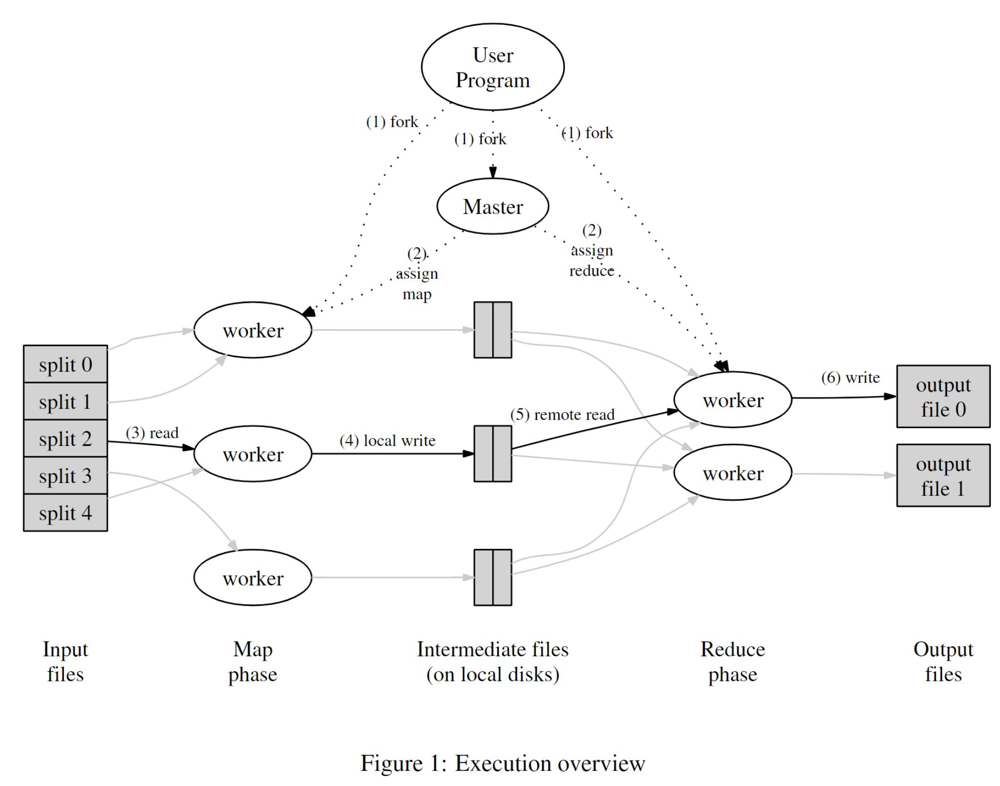

# MapReduce: Simplified Data Processing on Large Clusters（MapReduce: 简化大型集群下的数据处理）

##### 作者：Jeffrey Dean and Sanjay Ghemawat

### Abstract（摘要）
######
MapReduce is a programming model and an associated implementation for processing and generating large data sets. 
Users specify a map function that processes a key/value pair to generate a set of intermediate key/value pairs, 
and a reduce function that merges all intermediate values associated with the same intermediate key. 
Many real world tasks are expressible in this model, as shown in the paper.
#####
MapReduce是一个关于实施大型数据集处理和生成的编程模型。
用户指定一个用于处理**k/v对**并生成**中间态k/v对集合**的映射（map）函数，以及一个用于合并所有具有相同中间态key的中间态value值的归约（reduce）函数。
很多现实世界中的任务都可以通过该模型（MapReduce）表达，后续的论文中将会展示这一点。

#####
Programs written in this functional style are automatically parallelized and executed on a large cluster of commodity machines. 
The run-time system takes care of the details of partitioning the input data, 
scheduling the program’s execution across a set of machines, handling machine failures, 
and managing the required inter-machine communication. 
This allows programmers without any experience with parallel and distributed systems 
to easily utilize the resources of a large distributed system.
#####
以这种函数式风格编写的程序可以在一个大型的商用机器集群中自动、并行的执行。
该系统在运行时会关注如下细节：输入数据的分割，在一系列机器间跨机器的调度程序的执行，机器故障的处理以及管理集群内机器间的必要通信。
这（使用MapReduce）使得没有任何并行计算、分布式系统经验的程序员们都可以轻松利用大型分布式系统中的资源。

#####
Our implementation of MapReduce runs on a large cluster of commodity machines and is highly scalable:
a typical MapReduce computation processes many terabytes of data on thousands of machines. 
Programmers find the system easy to use: hundreds of MapReduce programs have been implemented 
and upwards of one thousand MapReduce jobs are executed on Google’s clusters every day.
#####
我们已实现的MapReduce运行在一个大型商用机器集群上，而且具有高度的可拓展性：一个典型的MapReduce计算可以在数千台机器上处理TB级别的数据。
程序员们发现系统很容易使用：已经有数以百计的MapReduce程序被实现，并且每天都有一千以上的MapReduce任务运行在谷歌的（计算机）集群中。

### 1 Introduction（介绍）
#####
Over the past five years, the authors and many others at Google have implemented hundreds of special-purpose computations 
that process large amounts of raw data, such as crawled documents, web request logs, etc.
, to compute various kinds of derived data, such as inverted indices, various representations of the graph structure of web documents, 
summaries of the number of pages crawled per host, the set of most frequent queries in a given day, etc. 
Most such computations are conceptually straightforward. 
However, the input data is usually large and the computations have to be distributed across hundreds or thousands of machines in order to finish in a reasonable amount of time. 
The issues of how to parallelize the computation, distribute the data, 
and handle failures conspire to obscure the original simple computation with large amounts of complex code to deal with these issues.
#####
在过去的五年时间里，包括作者在内的许多谷歌工作人员实现了数以百计的、用于特殊目的的计算程序来处理大量的原始数据，例如爬虫获取到的文档、网络请求日志等等。
其目的是为了计算出各种类型的衍生数据，例如倒排索引、多种关于web文档的图结构表示、被每个主机所爬取的页面数摘要、给定的某天中被最频繁查询的集合等等。
大多数这样的计算在概念上都很简单，然而输入的数据却通常是巨大的。而且为了能在一个合理的时间范围内完成，计算操作需要被分配到数百甚至数千台机器上运行。
关于如何并行计算，如何分派数据以及如何处理故障等问题被混杂在了一起，使得原本简单的计算逻辑被用于处理这些问题的大量复杂代码所模糊。

#####
As a reaction to this complexity, we designed a new abstraction that allows us to express the simple computations 
we were trying to perform but hides the messy details of parallelization, fault-tolerance, data distribution and load balancing in a library. 
Our abstraction is inspired by the map and reduce primitives present in Lisp and many other functional languages. 
We realized that most of our computations involved applying a map operation to each logical “record” in our input in order to compute a set of intermediate key/value pairs, 
and then applying a reduce operation to all the values that shared the same key, in order to combine the derived data appropriately. 
Our use of a functional model with user specified map and reduce operations allows us to parallelize large computations easily
and to use re-execution as the primary mechanism for fault tolerance.
#####
为了应对这些复杂性，我们设计了一个全新的抽象，该抽象允许我们表达我们想要执行的简单计算，但是将关于并行化、容错、数据分发和负载均衡等机制中复杂、繁琐的细节隐藏在了库中。
我们的这一抽象其设计灵感是来源于Lisp和很多其它函数式语言中的map和reduce原语。
我们意识到我们的绝大多数计算都涉及到为每一个输入的逻辑记录应用(applying)一个map映射操作，目的是对输入集计算从而将其转化为一个中间态的k/v对集合；
然后为了恰当地合并衍生数据，再对所有拥有相同key值的k/v对中的value值应用一个reduce规约操作。 
通过一个由用户指定具体逻辑的map和reduce操作的函数式模型，使得我们能轻易地并行化大规模的计算，并且将重复执行（自动重试）机制作为容错的主要手段。

#####
The major contributions of this work are a simple and powerful interface that enables automatic parallelization 
and distribution of large-scale computations, 
combined with an implementation of this interface that achieves high performance on large clusters of commodity PCs.
#####
这项工作的主要贡献在于提供了一个简单且强大的接口，该接口能够使大规模计算自动地并行化和分布式的执行。
结合该接口的实现，从而在大型的商用PC集群中获得高性能。

#####
Section 2 describes the basic programming model and gives several examples. 
Section 3 describes an implementation of the MapReduce interface tailored towards our cluster-based computing environment. 
Section 4 describes several refinements of the programming model that we have found useful. 
Section 5 has performance measurements of our implementation for a variety of tasks. 
Section 6 explores the use of MapReduce within Google including our experiences in using it 
as the basis for a rewrite of our production indexing system. 
Section 7 discusses related and future work.
#####
第二章介绍了基本的编程模型并给出了几个示例。
第三章介绍了一个针对集群计算环境的MapReduce接口实现。
第四章介绍了几个我们发现的，关于该编程模型的有效改进。
第五章则是关于我们对各式各样任务所实施的性能测量。
第六章探讨了MapReduce在谷歌内部的应用，其中包括了我们以MapReduce为基础去重建生产环境索引系统的经验。
第七章讨论了一些相关的话题以及日后要做的工作。

### 2 Programming Model（编程模型）
#####
The computation takes a set of input key/value pairs, and produces a set of output key/value pairs. 
The user of the MapReduce library expresses the computation as two functions: Map and Reduce.
#####
该计算获得并输入一个k/v键值对集合，然后生成并输出一个k/v键值对集合。
MapReduce库的用户通过Map和Reduce这两个函数来表达计算逻辑。

#####
Map, written by the user, takes an input pair and produces a set of intermediate key/value pairs. 
The MapReduce library groups together all intermediate values associated with the same intermediate key _I_ 
and passes them to the Reduce function.
#####
Map函数是由用户编写的，获得一个输入的k/v对并且生成一个中间态的k/v对。
MapReduce库对所有的k/v对进行分组，使得所有有着相同中间态key值的k/v对的value值组合在一起，然后将它们传递给Reduce函数。

#####
The Reduce function, also written by the user, accepts an intermediate key _I_ and a set of values for that key. 
It merges together these values to form a possibly smaller set of values. 
Typically just zero or one output value is produced per Reduce invocation. 
The intermediate values are supplied to the user’s reduce function via an iterator. 
This allows us to handle lists of values that are too large to fit in memory.
#####
Reduce函数也是由用户编写的，其接收一个中间态的key值和与该键对应的一组value值的集合。 它会将这些value值进行统一的合并以形成一个可能更小的value值集合。
通常，每次reduce调用只会生成零个或一个输出值。这个中间态的value集合通过一个迭代器提供给用户的reduce函数。
这允许我们得以处理那些无法被完整放入内存的，过大的list集合。

###2.1 Example（示例）
#####
Consider the problem of counting the number of occurrences of each word in a large collection of documents. 
The user would write code similar to the following pseudo-code:
#####
思考一个关于再一个大型文档集合中计算每一个单词出现次数的程序。
用户将写下形如以下伪代码的代码：
```
map(String key, String value):
    // key: document name
    // value: document contents
    for each word w in value:
        EmitIntermediate(w,"1");
reduce(String key, Iterator values):
    // key: a word
    // values: a list of counts
    int result = 0;
    for each v in values:
        result += ParseInt(v);
    Emit(AsString(result));
```

#####
The map function emits each word plus an associated count of occurrences (just ‘1’ in this simple example).
The reduce function sums together all counts emitted for a particular word.
#####
这个map映射函数发出每一个单词，并附加上其出现的次数（在这个简单的例子中恰好是1）。
这个reduce规约函数则累加统计每一个发出的特定单词所有的出现计数。

#####
In addition, the user writes code to fill in a mapreduce specification object with the names of the input and output files, and optional tuning parameters. 
The user then invokes the MapReduce function, passing it the specification object. 
The user’s code is linked together with the MapReduce library (implemented in C++). 
Appendix A contains the full program text for this example.
#####
此外，用户编写代码以指定的输入、输出文件的名字和可选的调优参数来填充一个规范的mapreduce对象。
用户然后调用MapReduce函数，传递这个符合规范的对象。
用户的代码与MapReduce库（c++实现）进行链接。
附录A包含了本示例的完整程序文本。

###2.2 Types（类型）
#####
Even though the previous pseudo-code is written in terms of string inputs and outputs, 
conceptually the map and reduce functions supplied by the user have associated types:
#####
尽管前面的伪代码是依据字符串类型的输入、输出编写的，
从概念上说，用户提供的map和reduce函数在类型上是有关联的：
```
map (k1,v1) --> list(k2,v2)
reduce (k2,list(v2)) --> list (v2)
```

#####
I.e., the input keys and values are drawn from a different domain than the output keys and values. 
Furthermore, the intermediate keys and values are from the same domain as the output keys and values.
#####
举个例子，输入的key和value和输出的key和value取自不同的域。
此外，中间态的key和value和输出的key和value则来自相同的域。

#####
Our C++ implementation passes strings to and from the user-defined functions 
and leaves it to the user code to convert between strings and appropriate types.
#####
我们在c++实现中传递字符串，作为用户自定义函数的输入和输出，并将其留给用户代码在字符串（类型）与合适的类型间进行转化。

### 2.3 More Examples（更多的例子）
#####
Here are a few simple examples of interesting programs that can be easily expressed as MapReduce computations.
#####
这里有几个很容易用MapReduce计算来表达的有趣程序的简单示例。

#####
**Distributed Grep:** The map function emits a line if it matches a supplied pattern. 
The reduce function is an identity function that just copies the supplied intermediate data to the output.
#####
**分布式Grep:**  
map函数输出匹配某个给定规则的一行。  
reduce函数是一个恒等函数，其只是将所输入的中间数据复制到输出（恒等函数：f(x) = x, 即输入=输出）。

#####
**Count of URL Access Frequency:** The map function processes logs of web page requests and outputs <URL,1>.
The reduce function adds together all values for the same URL and emits a <URL,total count> pair.
#####
**URL访问频率计数:**  
map函数处理网页请求的处理日志，并且输出<URL,1（访问数为1）>的键值对。  
reduce函数累加所有具有相同URL键值对的value值，并且输出一个<URL,总访问数>的键值对。

#####
**Reverse Web-Link Graph:** The map function outputs (target,source) pairs for each link to a target URL found in a page named source. 
The reduce function concatenates the list of all source URLs associated with a given target URL and emits the pair:(target,_list_(source))
#####
**反向网络链接图:**   
map函数从每一个源页面（source）中找出每一个目标页URL（target）的链接，输出（target，source）格式的kv对。  
reduce函数将所有具有相同target目标页的所有源页面（source）连接在一起组成一个列表，输出这样一个kv对（target,_list_(source)）。

#####
**Term-Vector per Host:** A term vector summarizes the most important words that occur in a document 
or a set of documents as a list of <word,frequency> pairs. 
The map function emits a <hostname,>pair for each input document (where the hostname is extracted from the URL of the document).
The reduce function is passed all per-document term vectors for a given host. 
It adds these term vectors together, throwing away infrequent terms, and then emits a final<hostname,term vector> pair.
#####
**每台主机的检索词向量**:  
汇总从一个或一系列文档中出现的最重要单词作为检索词向量（term-vector），生成以<word(单词),frequency(出现频次)>格式的kv对列表。  
map函数针对每一个输入的文档，输出一个<hostname(主机名),term vector(检索词向量)>的kv对（主机名是从文档的URL中提取出来的）。  
reduce函数接收一个给定host下所有的、基于每个文档的term-vectors(检索词向量)。将这些检索词向量进行累加，抛弃掉一些出现频率较低的检索词项，
然后返回最终的<hostname(主机名),term vector(检索词向量)>的kv对。

#####
**Inverted Index:** The map function parses each document, and emits a sequence of <word,document ID>pairs. 
The reduce function accepts all pairs for a given word, sorts the corresponding document IDs and emits a <word,_list_(document ID)> pair. 
The set of all output pairs forms a simple inverted index. 
It is easy to augment this computation to keep track of word positions.
#####
**倒排索引:**  
map函数解析每一个文档，然后输出一连串<word(单词)，documentID(文档ID)>格式的kv对。  
reduce函数接收一个给定单词对应的所有kv对，针对文档ID进行排序然后返回一个<word(单词),_list_documentID(文档ID列表)>格式的kv对。  
所有输出的kv对集合构成了一个简单的倒排索引。基于此，我们能简单的增加这种计算来追踪每一个单词(在这些文档中)的位置。

#####
Distributed Sort: The map function extracts the key from each record, and emits a <key,record> pair. 
The reduce function emits all pairs unchanged. 
This computation depends on the partitioning facilities described in Section 4.1 and the ordering properties described in Section 4.2.
#####
**分布式排序:**
map函数提取每一个记录中的key值，然后返回一个<key,record>格式的kv对。
reduce函数对所有的kv对不做修改直接返回。  
该计算依赖于后续4.1章节中所述的分区机制和4.2章节中所述的排序属性。

### 3 Implementation(实现)
#####
Many different implementations of the MapReduce interface are possible. 
The right choice depends on the environment. 
For example, one implementation may be suitable for a small shared-memory machine, 
another for a large NUMA multi-processor, and yet another for an even larger collection of networked machines.
#####
MapReduce接口可以有很多种不同的实现方式。如何进行正确的选择取决于环境。  
举个例子，某一种实现方式可能适合拥有较小共享内存的机器，而另一种实现方式则适用于大型的NUMA架构的多核处理器机器，还有的实现方式则更适用于基于网络的大型机器集群。

#####
This section describes an implementation targeted to the computing environment in wide use at Google:
large clusters of commodity PCs connected together with switched Ethernet.
In our environment:
(1) Machines are typically dual-processor x86 processors running Linux, with 2-4 GB of memory per machine.
(2) Commodity networking hardware is used – typically either 100 megabits/second or 1 gigabit/second at the machine level, 
but averaging considerably less in over-all bisection bandwidth.
(3) A cluster consists of hundreds or thousands of machines, and therefore machine failures are common.
(4) Storage is provided by inexpensive IDE disks attached directly to individual machines. 
A distributed file system developed in-house is used to manage the data stored on these disks. 
The file system uses replication to provide availability and reliability on top of unreliable hardware.
(5) Users submit jobs to a scheduling system. Each job consists of a set of tasks,
and is mapped by the scheduler to a set of available machines within a cluster.
#####
本章介绍一个针对谷歌内部广泛使用的计算环境下的(MapReduce)实现：通过交换式以太网互相连接起来的大型商用PC集群。  
在我们的环境中:  
(1) 机器通常是运行linux操作系统的、x86架构的双处理器的平台，每台机器有2-4GB的内存。  
(2) 使用商用的网络硬件 - 通常每台机器的带宽为100M/s或者1GB/s，但其平均(实际使用的)带宽远小于整个网络带宽的一半。  
(3) 一个集群由几百或几千的机器组成，因此机器故障是常见的。  
(4) 存储是由直接连接到独立机器上的IDE硬盘提供的。存储在这些磁盘上的数据由一个内部自研的分布式文件系统来管理。
这一文件系统采用复制机制，在不可靠的硬件之上实现可用性和可靠性。
(5) 用户提交作业(job)给一个调度系统。每一个作业都由一系列的任务(task)组成，且任务由调度器映射(调度)到内部集群中的一组可用机器上执行。

### 3.1 Execution Overview(执行概述)
#####
The Map invocations are distributed across multiple machines by automatically partitioning the input data into a set of M splits. 
The input splits can be processed in parallel by different machines. 
Reduce invocations are distributed by partitioning the intermediate key space into R pieces using a partitioning function (e.g., hash(key) mod R). 
The number of partitions (R) and the partitioning function are specified by the user.
#####
通过将输入的数据自动分割为M份，map调用得以分布在多个机器上调用执行。  
拆分后的输入数据可以被不同的机器并行的处理。  
通过一个分区函数将中间态的key值空间划分为R份(例如: hash(key) mod R, 对key做hash后再对R求模)，Reduce调用也得以分布式的执行。  
划分的个数(R)和分区函数都由用户来指定。



#####
Figure 1 shows the overall flow of a MapReduce operation in our implementation. 
When the user program calls the MapReduce function, the following sequence of actions occurs 
(the numbered labels in Figure 1 correspond to the numbers in the list below):

1. The MapReduce library in the user program first splits the input files into M pieces of typically 16 megabytes to 64 megabytes (MB) per piece
   (controllable by the user via an optional parameter).
   It then starts up many copies of the program on a cluster of machines.

2. One of the copies of the program is special – the master. The rest are workers that are assigned work by the master.
   There are M map tasks and R reduce tasks to assign. The master picks idle workers and assigns each one a map task or a reduce task.

3. A worker who is assigned a map task reads the contents of the corresponding input split.
   It parses key/value pairs out of the input data and passes each pair to the user-defined Map function.
   The intermediate key/value pairs produced by the Map function are buffered in memory.

4. Periodically, the buffered pairs are written to local disk, partitioned into R regions by the partitioning function.
   The locations of these buffered pairs on the local disk are passed back to the master,
   who is responsible for forwarding these locations to the reduce workers.

5. When a reduce worker is notified by the master about these locations,
   it uses remote procedure calls to read the buffered data from the local disks of the map workers.
   When a reduce worker has read all intermediate data, it sorts it by the intermediate keys so
   that all occurrences of the same key are grouped together.
   The sorting is needed because typically many different keys map to the same reduce task.
   If the amount of intermediate data is too large to fit in memory, an external sort is used.

6. The reduce worker iterates over the sorted intermediate data and for each unique intermediate key encountered,
   it passes the key and the corresponding set of intermediate values to the user’s Reduce function.
   The output of the Reduce function is appended to a final output file for this reduce partition.

7. When all map tasks and reduce tasks have been completed, the master wakes up the user program.
   At this point, the MapReduce call in the user program returns back to the user code.
#####
图1展示了我们所实现的MapReduce操作中的总体流程。当用户程序调用MapReduce函数时，会发生以下的一系列动作（图1中的数字标号与以下列表中的数字是一一对应的）:

1. 内嵌于用户程序中的MapReduce库首先会将输入的文件拆分为M份，每份大小通常为16MB至64MB（具体的大小可以由用户通过可选参数来控制）。
   随后便在集群中的一组机器上启动多个程序的副本。

2. 其中一个程序的副本是特殊的-即master(主人)。剩下的程序副本都是worker(工作者),worker由master来分配任务。
   这里有M个map任务和R个reduce任务需要分配。master选择空闲的worker，并且为每一个被选中的worker分配一个map任务或一个reduce任务。

3. 一个被分配了map任务的worker，读取被拆分后的对应输入内容。
   从输入的数据中解析出key/value键值对，并将每一个kv作为参数传递给用户自定义的map函数。 
   map函数会产生中间态的key/value键值对，并被缓存在内存之中。

4. 每隔一段时间，缓存在内存中的kv对会被写入本地磁盘，并被分区函数划分为R个区域。
   这些在本地磁盘上被缓冲的kv对的位置将会被回传给master，master负责将这些位置信息转发给后续执行reduce任务的worker。

5. 当一个负责reduce任务的worker被master通知了这些位置信息(map任务生成的中间态kv对数据所在的磁盘信息)， 
   该worker通过远过程调用(RPC)从负责map任务的worker机器的本地磁盘中读取被缓存的数据。
   当一个负责reduce任务的worker已经读取了所有的中间态数据，将根据中间态kv对的key值进行排序，因此所有拥有相同key值的kv对将会被分组在一起。
   需要排序的原因是因为通常很多不同的key(的kv对集合)会被映射到同一个reduce任务中去。如果(需要排序的)中间态的数据量过大，无法完全装进内存时，将会使用外排序。
   
6. 负责reduce任务的worker迭代所有被排好序的中间态数据，并将所遇到的每一个唯一的key值和其对应的中间态value值集合传递给用户自定义的reduce函数。
   reduce函数所产生的输出将会追加在一个该reduce分区内的、最终的输出文件内。

7. 当所有的map任务和reduce任务都完成后，master将唤醒用户程序。此时，调用MapReduce的用户程序(的执行流)将会返回到用户代码中。

#####
After successful completion, the output of the mapreduce execution is available in the R output files 
(one per reduce task, with file names as specified by the user).
Typically, users do not need to combine these R output files into one file – they often pass these files as input to another MapReduce call, 
or use them from another distributed application that is able to deal with input that is partitioned into multiple files.
#####
在成功的完成后，MapReduce执行的输出结果将被存放在R个输出文件中(每一个reduce任务都对应一个输出文件，输出文件的名字由用户指定)。  
通常，用户无需将这R个输出文件合并为一个文件 - 他们通常传递这些文件，将其作为另一个MapReduce调用的输入，  
或者由另一个能处理多个被分割的输入文件的分布式应用使用。

### 3.2 Master Data Structures(Master数据结构)
#####
The master keeps several data structures. For each map task and reduce task, it stores the state (idle, in-progress, or completed), 
and the identity of the worker machine(for non-idle tasks).
#####
master中维护了一些数据结构。对于每一个map和reduce任务，master存储了对应的任务状态(闲置的，运行中，或者已完成)，以及worker机器的id(针对非空闲的任务)。

#####
The master is the conduit through which the location of intermediate file regions is propagated from map tasks to reduce tasks. 
Therefore, for each completed map task, the master stores the locations and sizes of the R intermediate file regions produced by the map task. 
Updates to this location and size information are received as map tasks are completed. 
The information is pushed incrementally to workers that have in-progress reduce tasks.
#####
master是一个管道，将中间态文件的位置信息从map任务传递给reduce任务。  
因此，对于每个已完成的map任务，master存储了由map任务生成的R个中间态文件区域的位置和大小。  
当map任务完成时，master将更新接受到的(中间态文件区域)位置和大小信息。
这些信息的变更会以增量的方式推送给运行中的reduce任务。

### 3.3 Fault Tolerance(容错)
#####
Since the MapReduce library is designed to help process very large amounts of data using hundreds or thousands of machines, 
the library must tolerate machine failures gracefully.
#####
由于MapReduce库是被设计用于在几百或几千台机器上进行大规模数据处理的，所以该库必须能优雅地处理机器故障。

##### Worker Failure(Worker故障)
#####
The master pings every worker periodically.
If no response is received from a worker in a certain amount of time, the master marks the worker as failed.
Any map tasks completed by the worker are reset back to their initial idle state,
and therefore become eligible for scheduling on other workers.
Similarly, any map task or reduce task in progress on a failed worker is also reset to idle and becomes eligible for rescheduling.
#####
master会周期性的ping每一个worker。
如果在一定的时间内没有接收到来自某一worker的响应，master将会将worker标记为有故障(failed)。  
所有由该worker完成的map任务将会被重置回初始状态，因此这些map任务能被其它worker去调度执行。
类似的，任何在这个有故障的worker上处理中的map或reduce任务状态也将被重置为初始化，并且(这些被重置的任务)能够被重新调度执行。

#####
Completed map tasks are re-executed on a failure because their output is stored on the local disk(s) of the failed machine and is therefore inaccessible. 
Completed reduce tasks do not need to be re-executed since their output is stored in a global file system.
#####
已完成的map任务在故障时需要被重复执行的原因在于map任务的输出是被存储在故障机器的本地磁盘上的，因此无法被访问到(宕机或者网络不通等情况)。  
而已完成的reduce任务不需要重复执行的原因在于其输出是被存储在全局的文件系统中的。

#####
When a map task is executed first by worker A and then later executed by worker B (because A failed), all workers executing reduce tasks are notified of the re-execution. 
Any reduce task that has not already read the data from worker A will read the data from worker B.
#####
当一个map任务在worker A上被首次执行，不久后又被worker B执行(因为worker A发生了故障)，所有执行reduce任务的worker将会被通知需要重新执行。
所有还没有从worker A处读取(完整)数据的reduce任务将改为从worker B处读取数据。

#####
MapReduce is resilient to large-scale worker failures.
For example, during one MapReduce operation, network maintenance on a running cluster was causing groups of 80 machines at a time to become unreachable for several minutes. 
The MapReduce master simply re-executed the work done by the unreachable worker machines, and continued to make forward progress,eventually completing the MapReduce operation.
#####
MapReduce能从大范围的worker故障中迅速的恢复。
例如，在一个MapReduce操作运行期间内，一个正在运行的集群上的一次网络维护导致了80台机器在几分钟内无法访问的。  
MapReduce的master只需要将这些无法访问的机器上的任务重新的执行，然后继续向前推进，最终完成这个MapReduce操作。

##### Master Failure(Master故障)
#####
It is easy to make the master write periodic checkpoints of the master data structures described above. 
If the master task dies, a new copy can be started from the last checkpointed state. 
However, given that there is only a single master, its failure is unlikely; 
therefore our current implementation aborts the MapReduce computation if the master fails. 
Clients can check for this condition and retry the MapReduce operation if they desire.
#####
可以很简单的让master周期性的将上述的master数据结构以检查点的形式持久化。  
如果master任务机器宕机了，一个新的master备份机器将会从最新的检查点状态处启动。  
然而，考虑到只有一台master机器，是不太可能出现故障的；因此如果master故障了，我们当前的实现会中止MapReduce计算。
客户端可以检查master的这些状态，并根据需要重试MapReduce操作。


