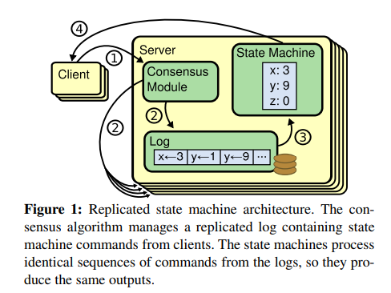

# In Search of an Understandable Consensus Algorithm(Extended Version)
寻找一种可理解的共识算法(拓展版)

##### 作者：斯坦福大学的Diego Ongaro和John Ousterhout

### Abstract(摘要)
#####
Raft is a consensus algorithm for managing a replicated log.
It produces a result equivalent to (multi-)Paxos, and it is as efficient as Paxos, but its structure is different from Paxos; 
this makes Raft more understandable than Paxos and also provides a better foundation for building practical systems.
In order to enhance understandability, Raft separates the key elements of consensus,
such as leader election, log replication, and safety, 
and it enforces a stronger degree of coherency to reduce the number of states that must be considered.
Results from a user study demonstrate that Raft is easier for students to learn than Paxos. 
Raft also includes a new mechanism for changing the cluster membership, which uses overlapping majorities to guarantee safety.
#####
Raft是一种用于管理复制日志的共识算法。
其和(multi-)Paxos算法作用相同，并且和Paxos一样高效，但其结构与Paxos不同；这使得Raft比起Paxos更容易理解同时也为构建实际可行的系统提供了一个更好的基础。
为了让Raft更容易理解，Raft拆分了有关共识的关键元素，例如leader选举，日志复制以及安全性等，并通过增强一致性的程度以减少必须被考虑的状态数量。
用户的研究成果表示Raft比起Paxos要更容易让学生进行学习。
Raft还包含了一个改变集群成员的新机制，其使用重叠的大多数(overlapping majorities)来保证安全。

### 1 Introduction(介绍)
Consensus algorithms allow a collection of machines to work as a coherent group that can survive the failures of some of its members.
Because of this, they play a key role in building reliable large-scale software systems.
Paxos has dominated the discussion of consensus algorithms over the last decade: 
most implementations of consensus are based on Paxos or influenced by it, 
and Paxos has become the primary vehicle used to teach students about consensus.
#####
共识算法允许一个机器的集群作为一个具有一致性的组来进行工作，使得在一些成员出现故障时集群依然能正常工作。
正因为如此，在构建可靠的大规模软件系统时其起到了关键的作用。
Paxos主导了过去十年中关于共识算法的讨论：
大多数的一致性的实现都给予Paxos或者受其影响，并且Paxos成为了教导学生一致性相关知识的主要工具。

#####
Unfortunately, Paxos is quite difficult to understand, in spite of numerous attempts to make it more approachable.
Furthermore, its architecture requires complex changes to support practical systems. 
As a result, both system builders and students struggle with Paxos.
#####
不幸的是，Paxos相当的难理解，尽管很多人试图让其变得更易理解。
此外，为了支持实际的系统其架构需要进行复杂的改变。
因此，所有的系统构建者和学生都在于Paxos进行斗争。

#####
After struggling with Paxos ourselves, 
we set out to find a new consensus algorithm that could provide a better foundation for system building and education. 
Our approach was unusual in that our primary goal was understandability: 
could we define a consensus algorithm for practical systems and describe it in a way that is significantly easier to learn than Paxos?
Furthermore, we wanted the algorithm to facilitate the development of intuitions that are essential for system builders.
It was important not just for the algorithm to work, but for it to be obvious why it works.
#####
我们在与Paxos斗争后，我们开始着手去寻找一种新的共识算法，其能够为构建系统和教育提供更好的支持。
我们的方法是不同寻常的，因为我们的主要目标是(增进)可理解性：我们可以为实际的系统定义一个共识算法并以比Paxos更容易学习的方式去描述它吗？
此外，我们希望该算法能够促进直觉的发展，这对系统构建者来说是必要的。
重要的不仅仅是算法是如何工作的，理解算法为什么能工作也是很重要的。

#####
The result of this work is a consensus algorithm called Raft.
In designing Raft we applied specific techniques to improve understandability,
including decomposition (Raft separates leader election, log replication, and safety) 
and state space reduction (relative to Paxos, Raft reduces the degree of nondeterminism and the ways servers can be inconsistent with each other). 
A user study with 43 students at two universities shows that Raft is significantly easier to understand than Paxos: 
after learning both algorithms, 33 of these students were able to answer questions about Raft better than questions about Paxos.
#####
这项工作的成果是一个名为Raft的共识算法。
在设计Raft时，我们应用了特别的技术来改善可理解性，包括分解(Raft将leader选举，日志复制和安全性进行了分解)
以及状态空间的缩减(相对于Paxos，Raft缩减了不确定性的程度以及服务器之间彼此不一致的方式)。
一项对两所大学中的43名学生的调查显示Raft比Paxos容易理解的多：在学习了两种算法后，相比回答Paxos相关问题，其中33名学生能更好的回答关于Raft的问题。

#####
Raft is similar in many ways to existing consensus algorithms (most notably, Oki and Liskov’s Viewstamped Replication),
but it has several novel features:
* **Strong leader:** Raft uses a stronger form of leadership than other consensus algorithms. 
  For example, log entries only flow from the leader to other servers.
  This simplifies the management of the replicated log and makes Raft easier to understand.
* **Leader election:** Raft uses randomized timers to elect leaders.
  This adds only a small amount of mechanism to the heartbeats already required for any consensus algorithm, 
  while resolving conflicts simply and rapidly.
* **Membership changes:** Raft’s mechanism for changing the set of servers in the cluster uses a new joint consensus approach
  where the majorities of two different configurations overlap during transitions.
  This allows the cluster to continue operating normally during configuration changes.

#####
Raft与已有的共识算法在很多方面都很相似(尤其是Oki和Liskov的Viewstamped Replication算法)，但Raft有几个新颖的功能：
* **Strong leader:** Raft使用比其它共识算法更强力的leader。
  举个例子，日志条目仅从leader流向其它服务器。这简化了被复制日志的管理并且使得Raft更加容易被理解。
* **Leader election:** Raft使用随机计时器来选举leader。
  这只在任何共识算法都需要的心跳检测中增加了少量机制，同时简单且快速的解决冲突。
* **Membership changes:** Raft用于改变集群中服务器集合的机制使用了一种新的联合共识方法，其中两个不同配置的多数在过渡期间是重叠的。
  这允许集群在配置改变时继续正常工作。

#####
We believe that Raft is superior to Paxos and other consensus algorithms, both for educational purposes and as a foundation for implementation. 
It is simpler and more understandable than other algorithms;
it is described completely enough to meet the needs of a practical system; 
it has several open-source implementations and is used by several companies; 
its safety properties have been formally specified and proven; and its efficiency is comparable to other algorithms.
#####
我们认为，无论是处于教育的目的还是作为实际(系统)的实现，Raft都是胜过Paxos和其它共识算法的。
它比其它算法更加简单和容易理解；
它被详细的描述使得其足以满足实际系统的需要；
它有着几个开源的实现并且被几家公司所使用；
它的安全性已经被正式的认定和证明；并且它的效率与其它算法相当。

#####
The remainder of the paper introduces the replicated state machine problem (Section 2), 
discusses the strengths and weaknesses of Paxos (Section 3), 
describes our general approach to understandability (Section 4),
presents the Raft consensus algorithm (Sections 5–8), 
evaluates Raft (Section 9), and discusses related work (Section 10).
#####
本文的剩余部分介绍了复制状态机问题(第2节)，
天伦了Paxos的优缺点(第3节)，
描述了我们使算法易于理解的一般性方法(第4节)，
提出了Raft共识算法(第5-8节)，
评估了Raft(第9节)，并且讨论了相关的工作(第10节)。

### 2 Replicated state machines(复制状态机)
#####
Consensus algorithms typically arise in the context of replicated state machines.
In this approach, state machines on a collection of servers compute identical copies of the same state
and can continue operating even if some of the servers are down. 
Replicated state machines are used to solve a variety of fault tolerance problems in distributed systems.
For example, large-scale systems that have a single cluster leader, such as GFS, HDFS, and RAMCloud, 
typically use a separate replicated state machine to manage leader election and store configuration information 
that must survive leader crashes. 
Examples of replicated state machines include Chubby and ZooKeeper.

#####
共识算法是在复制状态机的背景下产生的。
在这个方法中，服务器集合中的状态机在具有相同状态的完全一致的副本上进行计算，并且即使一些服务器已经宕机也能够持续的工作。
复制状态机被用于在分布式系统中解决一系列的容错问题。
举个例子，有着一个单独集群leader的大规模系统，例如GFS，HDFS以及RAMCloud，通常使用一个单独的复制状态机来管理leader选举和存储在leader崩溃后所必须的配置信息。
复制状态机的例子包括Chubby和ZooKeeper。

#####
Replicated state machines are typically implemented using a replicated log, as shown in Figure 1. 
Each server stores a log containing a series of commands, which its state machine executes in order. 
Each log contains the same commands in the same order, so each state machine processes the same sequence of commands.
Since the state machines are deterministic, each computes the same state and the same sequence of outputs.
#####
复制状态机通常使用复制log(replicated log)来实现，如图1所示。
每个服务器存储着一个包含一系列指令的日志，这些指令在状态机上被顺序执行。
每个日志中包含了以相同顺序排布的相同的指令，因此每个状态机都处理相同的指令序列。
因为状态机是确定性的，每一个状态机都计算出相同的状态以及有着相同的输出序列。

#####
Keeping the replicated log consistent is the job of the consensus algorithm. 
The consensus module on a server receives commands from clients and adds them to its log.
It communicates with the consensus modules on other servers to ensure that every log eventually contains 
the same requests in the same order, even if some servers fail.
Once commands are properly replicated, each server’s state machine processes them in log order, 
and the outputs are returned to clients. 
As a result, the servers appear to form a single, highly reliable state machine.
#####
保持复制日志的一致性是共识算法的工作。
服务器中的共识模块接受来自客户端的指令并且将其加入日志。
它与其它服务器的共识模块进行通信以确保每一个日志最终以同样的顺序包含同样的请求，即使其中一些服务器故障了。
一旦指令被正确的复制，每一个服务器的状态机都按照日志中的顺序处理这些指令，并将输出返回给客户端。
因此，服务器的集合似乎形成了一个单独的，高度可靠的状态机。

#####
Consensus algorithms for practical systems typically have the following properties:
* They ensure safety (never returning an incorrect result) under all non-Byzantine conditions, 
  including network delays, partitions, and packet loss, duplication, and reordering.
* They are fully functional (available) as long as any majority of the servers are operational 
  and can communicate with each other and with clients.
  Thus, a typical cluster of five servers can tolerate the failure of any two servers. 
  Servers are assumed to fail by stopping; they may later recover from state on stable storage and rejoin the cluster
* They do not depend on timing to ensure the consistency of the logs: 
  faulty clocks and extreme message delays can, at worst, cause availability problems.
* In the common case, a command can complete as soon as a majority of the cluster has responded to a single round of remote procedure calls;
  a minority of slow servers need not impact overall system performance.

