# In Search of an Understandable Consensus Algorithm(Extended Version)
寻找一种可理解的一致性算法(拓展版)

##### 作者：斯坦福大学的Diego Ongaro和John Ousterhout

## Abstract(摘要)
#####
Raft is a consensus algorithm for managing a replicated log.
It produces a result equivalent to (multi-)Paxos, and it is as efficient as Paxos, but its structure is different from Paxos; 
this makes Raft more understandable than Paxos and also provides a better foundation for building practical systems.
In order to enhance understandability, Raft separates the key elements of consensus,
such as leader election, log replication, and safety, 
and it enforces a stronger degree of coherency to reduce the number of states that must be considered.
Results from a user study demonstrate that Raft is easier for students to learn than Paxos. 
Raft also includes a new mechanism for changing the cluster membership, which uses overlapping majorities to guarantee safety.
#####
Raft是一种用于管理复制日志的一致性算法。
其和(multi-)Paxos算法作用相同，并且和Paxos一样高效，但其结构与Paxos不同；这使得Raft比起Paxos更容易理解同时也为构建实际可行的系统提供了一个更好的基础。
为了让Raft更容易理解，Raft拆分了有关一致性的关键元素，例如leader选举，日志复制以及安全性等，并通过增强一致性的程度以减少必须被考虑的状态数量。
用户的研究成果表示Raft比起Paxos要更容易让学生进行学习。
Raft还包含了一个改变集群成员的新机制，其使用重叠的大多数(overlapping majorities)来保证安全。

## 1 Introduction(介绍)
Consensus algorithms allow a collection of machines to work as a coherent group that can survive the failures of some of its members.
Because of this, they play a key role in building reliable large-scale software systems.
Paxos has dominated the discussion of consensus algorithms over the last decade: 
most implementations of consensus are based on Paxos or influenced by it, 
and Paxos has become the primary vehicle used to teach students about consensus.
#####
一致性算法允许一个机器的集群作为一个具有一致性的组来进行工作，使得在一些成员出现故障时集群依然能正常工作。
正因为如此，在构建可靠的大规模软件系统时其起到了关键的作用。
Paxos主导了过去十年中关于一致性算法的讨论：
大多数的一致性的实现都给予Paxos或者受其影响，并且Paxos成为了教导学生一致性相关知识的主要工具。

#####
Unfortunately, Paxos is quite difficult to understand, in spite of numerous attempts to make it more approachable.
Furthermore, its architecture requires complex changes to support practical systems. 
As a result, both system builders and students struggle with Paxos.
#####
不幸的是，Paxos相当的难理解，尽管很多人试图让其变得更易理解。
此外，为了支持实际的系统其架构需要进行复杂的改变。
因此，所有的系统构建者和学生都在于Paxos进行斗争。

#####
After struggling with Paxos ourselves, 
we set out to find a new consensus algorithm that could provide a better foundation for system building and education. 
Our approach was unusual in that our primary goal was understandability: 
could we define a consensus algorithm for practical systems and describe it in a way that is significantly easier to learn than Paxos?
Furthermore, we wanted the algorithm to facilitate the development of intuitions that are essential for system builders.
It was important not just for the algorithm to work, but for it to be obvious why it works.
#####
我们在与Paxos斗争后，我们开始着手去寻找一种新的一致性算法，其能够为构建系统和教育提供更好的支持。
我们的方法是不同寻常的，因为我们的主要目标是(增进)可理解性：我们可以为实际的系统定义一个一致性算法并以比Paxos更容易学习的方式去描述它吗？
此外，我们希望该算法能够促进直觉的发展，这对系统构建者来说是必要的。
重要的不仅仅是算法是如何工作的，理解算法为什么能工作也是很重要的。

#####
The result of this work is a consensus algorithm called Raft.
In designing Raft we applied specific techniques to improve understandability,
including decomposition (Raft separates leader election, log replication, and safety) 
and state space reduction (relative to Paxos, Raft reduces the degree of nondeterminism and the ways servers can be inconsistent with each other). 
A user study with 43 students at two universities shows that Raft is significantly easier to understand than Paxos: 
after learning both algorithms, 33 of these students were able to answer questions about Raft better than questions about Paxos.
#####
这项工作的成果是一个名为Raft的一致性算法。
在设计Raft时，我们应用了特别的技术来改善可理解性，包括分解(Raft将leader选举，日志复制和安全性进行了分解)
以及状态空间的缩减(相对于Paxos，Raft缩减了不确定性的程度以及服务器之间彼此不一致的方式)。
一项对两所大学中的43名学生的调查显示Raft比Paxos容易理解的多：在学习了两种算法后，相比回答Paxos相关问题，其中33名学生能更好的回答关于Raft的问题。

#####
Raft is similar in many ways to existing consensus algorithms (most notably, Oki and Liskov’s Viewstamped Replication),
but it has several novel features:
* **Strong leader:** Raft uses a stronger form of leadership than other consensus algorithms. 
  For example, log entries only flow from the leader to other servers.
  This simplifies the management of the replicated log and makes Raft easier to understand.
* **Leader election:** Raft uses randomized timers to elect leaders.
  This adds only a small amount of mechanism to the heartbeats already required for any consensus algorithm, 
  while resolving conflicts simply and rapidly.
* **Membership changes:** Raft’s mechanism for changing the set of servers in the cluster uses a new joint consensus approach
  where the majorities of two different configurations overlap during transitions.
  This allows the cluster to continue operating normally during configuration changes.

#####
Raft与已有的一致性算法在很多方面都很相似(尤其是Oki和Liskov的Viewstamped Replication算法)，但Raft有几个新颖的功能：
* **Strong leader:** Raft使用比其它一致性算法更强力的leader。
  举个例子，日志条目仅从leader流向其它服务器。这简化了被复制日志的管理并且使得Raft更加容易被理解。
* **Leader election:** Raft使用随机计时器来选举leader。
  这只在任何一致性算法都需要的心跳检测中增加了少量机制，同时简单且快速的解决冲突。
* **Membership changes:** Raft用于改变集群中服务器集合的机制使用了一种新的联合的一致性方法，其中两个不同配置的多数在过渡期间是重叠的。
  这允许集群在配置改变时继续正常工作。

#####
We believe that Raft is superior to Paxos and other consensus algorithms, both for educational purposes and as a foundation for implementation. 
It is simpler and more understandable than other algorithms;
it is described completely enough to meet the needs of a practical system; 
it has several open-source implementations and is used by several companies; 
its safety properties have been formally specified and proven; and its efficiency is comparable to other algorithms.
#####
我们认为，无论是处于教育的目的还是作为实际(系统)的实现，Raft都是胜过Paxos和其它一致性算法的。
它比其它算法更加简单和容易理解；
它被详细的描述使得其足以满足实际系统的需要；
它有着几个开源的实现并且被几家公司所使用；
它的安全性已经被正式的认定和证明；并且它的效率与其它算法相当。

#####
The remainder of the paper introduces the replicated state machine problem (Section 2), 
discusses the strengths and weaknesses of Paxos (Section 3), 
describes our general approach to understandability (Section 4),
presents the Raft consensus algorithm (Sections 5–8), 
evaluates Raft (Section 9), and discusses related work (Section 10).
#####
本文的剩余部分介绍了复制状态机问题(第2节)，
天伦了Paxos的优缺点(第3节)，
描述了我们使算法易于理解的一般性方法(第4节)，
提出了Raft一致性算法(第5-8节)，
评估了Raft(第9节)，并且讨论了相关的工作(第10节)。

## 2 Replicated state machines(复制状态机)
#####
Consensus algorithms typically arise in the context of replicated state machines.
In this approach, state machines on a collection of servers compute identical copies of the same state
and can continue operating even if some of the servers are down. 
Replicated state machines are used to solve a variety of fault tolerance problems in distributed systems.
For example, large-scale systems that have a single cluster leader, such as GFS, HDFS, and RAMCloud, 
typically use a separate replicated state machine to manage leader election and store configuration information 
that must survive leader crashes. 
Examples of replicated state machines include Chubby and ZooKeeper.

#####
一致性算法是在复制状态机的背景下产生的。
在这个方法中，服务器集合中的状态机在具有相同状态的完全一致的副本上进行计算，并且即使一些服务器已经宕机也能够持续的工作。
复制状态机被用于在分布式系统中解决一系列的容错问题。
举个例子，有着一个单独集群leader的大规模系统，例如GFS，HDFS以及RAMCloud，通常使用一个单独的复制状态机来管理leader选举和存储在leader崩溃后所必须的配置信息。
复制状态机的例子包括Chubby和ZooKeeper。

#####
Replicated state machines are typically implemented using a replicated log, as shown in Figure 1. 
Each server stores a log containing a series of commands, which its state machine executes in order. 
Each log contains the same commands in the same order, so each state machine processes the same sequence of commands.
Since the state machines are deterministic, each computes the same state and the same sequence of outputs.
#####
复制状态机通常使用复制log(replicated log)来实现，如图1所示。
每个服务器存储着一个包含一系列指令的日志，这些指令在状态机上被顺序执行。
每个日志中包含了以相同顺序排布的相同的指令，因此每个状态机都处理相同的指令序列。
因为状态机是确定性的，每一个状态机都计算出相同的状态以及有着相同的输出序列。

#####
Keeping the replicated log consistent is the job of the consensus algorithm. 
The consensus module on a server receives commands from clients and adds them to its log.
It communicates with the consensus modules on other servers to ensure that every log eventually contains 
the same requests in the same order, even if some servers fail.
Once commands are properly replicated, each server’s state machine processes them in log order, 
and the outputs are returned to clients. 
As a result, the servers appear to form a single, highly reliable state machine.
#####
保持复制日志的一致性是一致性算法的工作。
服务器中的一致性模块接受来自客户端的指令并且将其加入日志。
它与其它服务器的一致性模块进行通信以确保每一个日志最终以同样的顺序包含同样的请求，即使其中一些服务器故障了。
一旦指令被正确的复制，每一个服务器的状态机都按照日志中的顺序处理这些指令，并将输出返回给客户端。
因此，服务器的集合似乎形成了一个单独的，高度可靠的状态机。

#####
Consensus algorithms for practical systems typically have the following properties:
* They ensure safety (never returning an incorrect result) under all non-Byzantine conditions, 
  including network delays, partitions, and packet loss, duplication, and reordering.
* They are fully functional (available) as long as any majority of the servers are operational 
  and can communicate with each other and with clients.
  Thus, a typical cluster of five servers can tolerate the failure of any two servers. 
  Servers are assumed to fail by stopping; they may later recover from state on stable storage and rejoin the cluster.
* They do not depend on timing to ensure the consistency of the logs: 
  faulty clocks and extreme message delays can, at worst, cause availability problems.
* In the common case, a command can complete as soon as a majority of the cluster has responded to a single round of remote procedure calls;
  a minority of slow servers need not impact overall system performance.

#####
实际系统中的一致性算法通常具有以下属性：
* 它们确保在所有非拜占庭条件下的安全性(永远不返回错误结果)，(非拜占庭条件)包括网络延迟，分区，和丢包，重复以及重新排序。
* 只要大多数服务器能够正常工作并且能够与其它服务器以及客户端互相通信，一致性算法就能发挥其全部的功能(可用性)。
  因此，一个典型的有着5台服务器组成的集群能够容忍任意两台服务器出现故障。
  假设服务器因为故障而停机；他们可以稍后从稳定的存储状态中恢复并重新加入集群。
* 他们不依赖时间来确保日志的一致性：错误的时钟和极端的消息延迟在最坏的情况下会造成可用性问题。
* 通常情况下，只要集群中的大多数对单轮的远过程调用做出了响应，命令就可以完成。占少数的慢速服务器不会对系统整体性能造成影响。

## 3 What’s wrong with Paxos?(Paxos存在的问题)
#####
Over the last ten years, Leslie Lamport’s Paxos protocol has become almost synonymous with consensus:
it is the protocol most commonly taught in courses, and most implementations of consensus use it as a starting point.
Paxos first defines a protocol capable of reaching agreement on a single decision, such as a single replicated log entry. 
We refer to this subset as single-decree Paxos. 
Paxos then combines multiple instances of this protocol to facilitate a series of decisions such as a log (multi-Paxos).
Paxos ensures both safety and liveness, and it supports changes in cluster membership. 
Its correctness has been proven, and it is efficient in the normal case.
#####
在过去的十年中，Leslie Lamport的Paxos协议几乎已经成为了一致性算法的代名词：
它是课堂教学中最常用的协议，大多数的一致性算法也将其作为起点。
Paxos首先定义了一个协议，其能够就单个决定达成一致，例如单个日志条目的复制。
我们将这一自己称为single-decree Paxos。
然后Paxos将该协议的多个实例组合起来以达成一系列的决定，例如日志(multi-Paxos)。
Paxos同时保证了安全性和活性，并且支持集群成员的变更。
其正确性已经得到证明，并且在通常情况下是高效的。

#####
Unfortunately, Paxos has two significant drawbacks.
The first drawback is that Paxos is exceptionally difficult to understand. 
The full explanation is notoriously opaque; few people succeed in understanding it, and only with great effort.
As a result, there have been several attempts to explain Paxos in simpler terms.
These explanations focus on the single-decree subset, yet they are still challenging. 
In an informal survey of attendees at NSDI 2012, we found few people who were comfortable with Paxos, even among seasoned researchers.
We struggled with Paxos ourselves; 
we were not able to understand the complete protocol until after reading several simplified explanations 
and designing our own alternative protocol, a process that took almost a year.
#####
不幸的是，Paxos有着两个明显的缺点。
第一个缺点是Paxos异乎寻常的难理解。
Paxos出了名的难理解，即使在付出了巨大努力的情况下，也很少有人能成功的理解它。
因此，有一些人尝试着用更简单的方式来理解Paxos。
这些解释聚焦于single-decree这一子集，但这仍具有挑战性。
在一项针对NSDI 2012与会者的非正式调查中，我们发现很少有人对Paxos感到满意，即使对于经验丰富的研究员来说也是如此。
我们也与Paxos进行了艰难的斗争；直到阅读了几个简化的解释并设计了我们自己的替代方案后我们才能够理解完整的协议，而这个过程花费了将近一年的时间。

#####
We hypothesize that Paxos’ opaqueness derives from its choice of the single-decree subset as its foundation.
Single-decree Paxos is dense and subtle: 
it is divided into two stages that do not have simple intuitive explanations and cannot be understood independently. 
Because of this, it is difficult to develop intuitions about why the single-decree protocol works.
The composition rules for multi-Paxos add significant additional complexity and subtlety. 
We believe that the overall problem of reaching consensus on multiple decisions (i.e., a log instead of a single entry) 
can be decomposed in other ways that are more direct and obvious.
#####
我们猜定Paxos晦涩难懂的原因在于作者选择以single-decree这一子集作为Paxos的基础。
Single-decree Paxos是难理解和精巧的：
它被分为了两个阶段，并且没有简单直接的说明，每一阶段也无法单独的理解。
正因如此，很难凭借直觉的理解single-decree协议为什么能够工作。
multi-Paxos的组合规则也显著的增加了复杂性和微妙之处。
我们认为，就多个决定达成一致的总体问题(例如，使用日志而不是单个的entry)能够被分解为其它更直接和更容易理解的方式。

#####
The second problem with Paxos is that it does not provide a good foundation for building practical implementations. 
One reason is that there is no widely agreed-upon algorithm for multi-Paxos.
Lamport’s descriptions are mostly about single-decree Paxos; 
he sketched possible approaches to multi-Paxos, but many details are missing. 
There have been several attempts to flesh out and optimize Paxos, such as [26], [39], and [13], 
but these differ from each other and from Lamport’s sketches.
Systems such as Chubby [4] have implemented Paxos-like algorithms, but in most cases their details have not been published.
#####
Paxos的第二个问题是它没有为构建实际可行的实现提供一个好的基础。
其中一个原因是对于multi-Paxos没有一个被广泛认同的算法。
Lamport的描述大多数都是关于single-decree Paxos的；他简要的概述了实现multi-Paxos的可行的方法，但缺失了很多的细节。
已经有几个(团队)试图去具体化和优化Paxos，例如[26],[39]和[13],但这些尝试彼此间不同且也不同于Lamport的概述。
像Chubby系统已经实现了类似Paxos的算法，但大多数情况下的细节并没有被公开。

#####
Furthermore, the Paxos architecture is a poor one for building practical systems; 
this is another consequence of the single-decree decomposition.
For example, there is little benefit to choosing a collection of log entries independently and then melding them into a sequential log;
this just adds complexity. 
It is simpler and more efficient to design a system around a log, 
where new entries are appended sequentially in a constrained order. 
Another problem is that Paxos uses a symmetric peer-to-peer approach at its core
(though it eventually suggests a weak form of leadership as a performance optimization).
This makes sense in a simplified world where only one decision will be made, but few practical systems use this approach.
If a series of decisions must be made, it is simpler and faster to first elect a leader, then have the leader coordinate the decisions.
#####
此外，Paxos的架构在构建实际的系统时表现不佳；这是对single-decree进行分解的另一个结果。
例如，选择一组独立的日志集合并将其合并到一个顺序日志中几乎没有带来什么好处；这只会增加复杂性。
围绕日志来设计系统会更简单和更高效，其中新的日志条目以受约束的顺序追加。
另一个问题是，Paxos使用了一种对称的点对点(P2P)方法作为其核心(尽管最后提出了一种更弱形式的leadership作为性能优化)。
在一个只需要做一次决定的，被简化的世界中这样是行得通的，但很少有实际的系统使用这个方式。
如果有一系列的决定必须要做，首先选举出一个leader，然后leader来协调决策会更简单和更快速。

#####
As a result, practical systems bear little resemblance to Paxos. 
Each implementation begins with Paxos, discovers the difficulties in implementing it, 
and then develops a significantly different architecture. 
This is time-consuming and error-prone, and the difficulties of understanding Paxos exacerbate the problem.
Paxos’ formulation may be a good one for proving theorems about its correctness, 
but real implementations are so different from Paxos that the proofs have little value. 
#####
The following comment from the Chubby implementers is typical:  
_There are significant gaps between the description of the Paxos algorithm 
and the needs of a real-world system. . . . the final system will be based on an unproven protocol [4]._
#####
因此，实际的系统与Paxos几乎没有相似之处。
每一个实现都从Paxos出发，发现实现Paxos的困难之处，然后开发出一个与之截然不同的架构。
这既耗费时间又容易出错，并且Paxos的晦涩难懂加剧了这一问题。
Paxos的公式可能可以很好的证明其正确性，但是实际的实现与Paxos是如此的不同，以至于这些证明几乎毫无价值。
#####
以下Chubby实现者的评论是具有代表性的：  
_Paxos算法的描述与现实世界系统的需求之间有着巨大的鸿沟....最终的系统将建立在一个未被证明的协议之上。_

#####
Because of these problems, we concluded that Paxos does not provide a good foundation either for system building or for education.
Given the importance of consensus in large-scale software systems,
we decided to see if we could design an alternative consensus algorithm with better properties than Paxos. 
Raft is the result of that experiment.
#####
由于这些问题，我们的结论是Paxos并没有为构建系统或是进行教育提供一个好的基础。
考虑到一致性在大规模软件系统中的重要性，我们决定看看我们是否可以设计出一个比起Paxos有着更好特性的一致性算法。
Raft正是这一实验的成果。

## 4 Designing for understandability(为通俗易懂而设计)
#####
We had several goals in designing Raft: it must provide a complete and practical foundation for system building,
so that it significantly reduces the amount of design work required of developers; 
it must be safe under all conditions and available under typical operating conditions; and it must be efficient for common operations.
But our most important goal—and most difficult challenge—was understandability. 
It must be possible for a large audience to understand the algorithm comfortably. 
In addition, it must be possible to develop intuitions about the algorithm,
so that system builders can make the extensions that are inevitable in real-world implementations.
#####
我们在设计Raft时有几个目标：它必须为构建系统提供一个完整的和实际的基础，从而显著的减少开发者设计时所需的工作；
它必须在任何条件下都是安全的并且在典型的工作状态下是可用的；同时它必须在通常工作状态下是高效的。
但我们最重要的目标也是最困难的挑战是使得Raft通俗易懂。
必须尽可能的使大多数人能够轻松的理解该算法。
这样系统构建者才能够在现实世界的实现中进行不可避免的拓展。

#####
There were numerous points in the design of Raft where we had to choose among alternative approaches.
In these situations we evaluated the alternatives based on understandability: 
how hard is it to explain each alternative (for example, how complex is its state space,
and does it have subtle implications?), and how easy will it be for a reader to completely understand the approach and its implications?
#####
在设计Raft时有很多要点都必须在多个可选方案中抉择。
在这些情况下，我们基于易懂性来评估这些可选方案：  
对于每一个可选方案解释起来有多困难(例如，状态空间有多复杂以及是否有微妙的含义？)，以及对于一个读者来说完全理解这个方法和其含义有多容易？

#####
We recognize that there is a high degree of subjectivity in such analysis; nonetheless, we used two techniques that are generally applicable.
The first technique is the well-known approach of problem decomposition: 
wherever possible, we divided problems into separate pieces that could be solved, explained, and understood relatively independently. 
For example, in Raft we separated leader election, log replication, safety, and membership changes.
#####
我们意识到这一分析方式具有高度的主观性；尽管如此，但我们还是使用了两种可行的通用技术。
第一个技术是众所周知的问题分解方法：
在可能的情况下，我们将问题分解为几个部分，使得每一部分都可以被相对独立的解决，解释和理解。
例如，我们将Raft分解为leader选举，日志复制，安全性和成员变更这几个部分。

#####
Our second approach was to simplify the state space by reducing the number of states to consider,
making the system more coherent and eliminating nondeterminism where possible. 
Specifically, logs are not allowed to have holes, and Raft limits the ways in which logs can become inconsistent with each other.
Although in most cases we tried to eliminate nondeterminism, there are some situations where nondeterminism actually improves understandability.
In particular, randomized approaches introduce nondeterminism, 
but they tend to reduce the state space by handling all possible choices in a similar fashion(“choose any; it doesn’t matter”). 
We used randomization to simplify the Raft leader election algorithm.
#####
我们的第二种方法是通过减少需要考虑的状态数量以简化状态空间，使系统变得更加连贯并尽可能的消除不确定性。
特别的，日志是不允许存在空洞的，并且Raft限制了使得日志间变得彼此不一致的方式。
尽管在大多数情况下我们试图消除不确定性，但在一些条件下不确定性实际上能提高可理解性。
特别的，随机化方法引入了不确定性，但它们倾向于通过用相似的方式来处理所有可能的选择以减少状态空间("选择任意一个;具体是哪一个则无关紧要")。
我们使用随机化来简化Raft中的leader选举算法。

## 5. The Raft consensus algorithm(Raft一致性算法)
#####
Raft is an algorithm for managing a replicated log of the form described in Section 2. 
Figure 2 summarizes the algorithm in condensed form for reference, and Figure 3 lists key properties of the algorithm;
the elements of these figures are discussed piecewise over the rest of this section.
#####
Raft是一种管理如第二节所述的复制日志的算法。
图2以简明扼要的总结了算法以供参考，图3列举出了算法的关键特性；这些图中的元素将在本节剩余的部分中进行讨论。

#####
Raft implements consensus by first electing a distinguished leader, 
then giving the leader complete responsibility for managing the replicated log.
The leader accepts log entries from clients, 
replicates them on other servers, and tells servers when it is safe to apply log entries to their state machines. 
Having a leader simplifies the management of the replicated log. 
For example, the leader can decide where to place new entries in the log without consulting other servers,
and data flows in a simple fashion from the leader to other servers. 
A leader can fail or become disconnected from the other servers, in which case a new leader is elected.
#####
Raft通过受限选举出一位distinguished leader，然后让它全权的管理复制日志以实现一致性。
这个leader接受来自客户端的日志条目，将其复制到其它服务器中，并且在日志条目可以被安全的应用在它们的状态机上时通知这些服务器。
拥有一个leader可以简化对复制日志的管理。
例如，leader可以决定新日志条目的位置而无需咨询其它服务器，并且数据流以一种简单的形式由leader流向其它服务器。
leader可能会故障或者与其它服务器失联，这种情况下一位新的leader将会被选举出来。

#####
Given the leader approach, Raft decomposes the consensus problem into three relatively independent sub-problems, 
which are discussed in the subsections that follow:
* **Leader election:** a new leader must be chosen when an existing leader fails (Section 5.2).
* **Log replication:** the leader must accept log entries from clients and replicate them across the cluster,
  forcing the other logs to agree with its own (Section 5.3).
* **Safety:** the key safety property for Raft is the State Machine Safety Property in Figure 3: 
  if any server has applied a particular log entry to its state machine,
  then no other server may apply a different command for the same log index.
  Section 5.4 describes how Raft ensures this property; 
  the solution involves an additional restriction on the election mechanism described in Section 5.2.

After presenting the consensus algorithm, this section discusses the issue of availability and the role of timing in the system.
#####
通过引入leader的方法，Raft将一致性问题分解为3个相对独立的子问题，这些子问题将在以下子章节中被讨论：
* **leader选举：** 当一位现存的leader故障时必须选出一位新的leader(5.2节)。
* **日志复制：** leader必须从客户端接收日志条目并且在集群中复制它们，并且强制其它节点的日志与leader保持一致(5.3节)。
* **安全性：** Raft的关键安全特性就是图3中的状态机的安全特性：如果任一服务器已经将一个特定的日志条目作用于它的状态机，则没有任何服务器可以对相同的日志索引应用不同的指令。
  5.4节描述了Raft是如何确保这一特性的；这一解决方案涉及到对5.2节中所描述的选举机制的额外限制。  
#####
在展示了一致性算法后，本章节还将讨论可用性问题以及时序在系统中起到的作用。

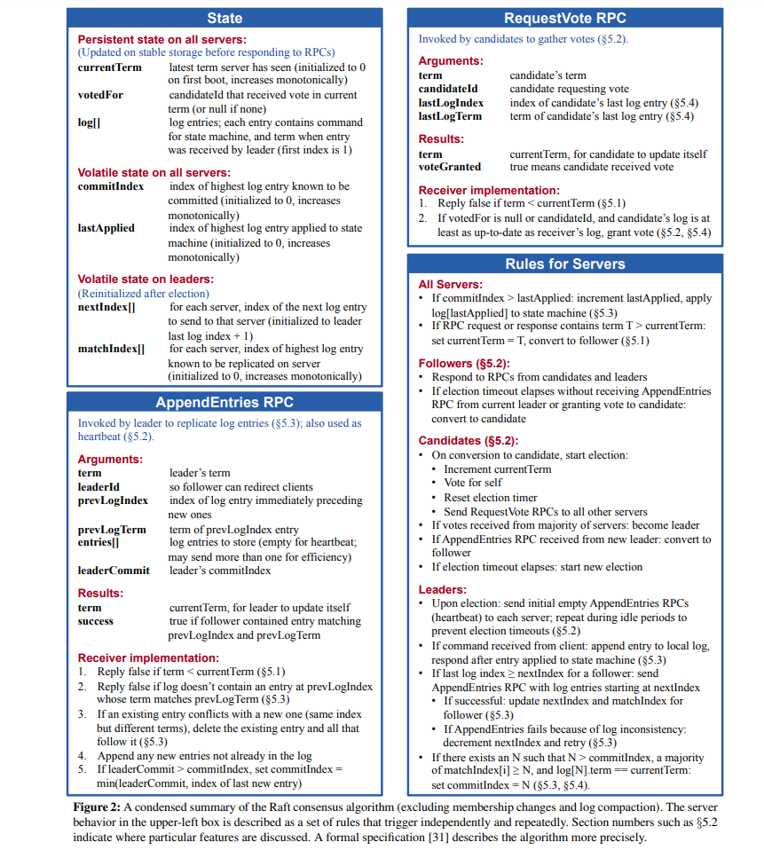
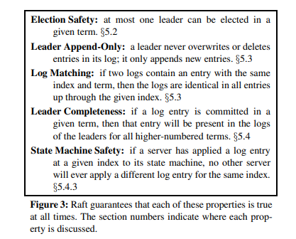

### 5.1 Raft basics(Raft基础)
#####
A Raft cluster contains several servers; five is a typical number, which allows the system to tolerate two failures.
At any given time each server is in one of three states: leader, follower, or candidate.
In normal operation there is exactly one leader and all of the other servers are followers. 
Followers are passive: they issue no requests on their own but simply respond to requests from leaders and candidates.
The leader handles all client requests (if a client contacts a follower, the follower redirects it to the leader).
The third state, candidate, is used to elect a new leader as described in Section 5.2. 
Figure 4 shows the states and their transitions; the transitions are discussed below.
#####
一个Raft的集群包含几个服务器;通常是5个节点，这样的系统能容忍系统中的2个节点出现故障。
在任一给定的时间内，每个服务器只会处于3种状态中的一种：领导者(leader),追随者(follower)，或者候选者(candidate)。
在通常情况下，只会有1个leader并且其它的服务器都是follower。
Follower都是被动的: 它们自己不会提出请求而只会简单的响应来自leader和candidate的请求。
leader处理所有来自客户端的请求(如果一个客户端与follower进行联络，follower会将其重定向到leader)。
第三种状态，candidate，用于选举出一个如5.2章节所描述的新leader。
图4展示了状态以及状态间的转换关系；转换关系将在下文被讨论。

#####
Raft divides time into terms of arbitrary length, as shown in Figure 5. 
Terms are numbered with consecutive integers.
Each term begins with an election, in which one or more candidates attempt to become leader as described in Section 5.2.
If a candidate wins the election, then it serves as leader for the rest of the term. 
In some situations an election will result in a split vote.
In this case the term will end with no leader; a new term (with a new election) will begin shortly. 
Raft ensures that there is at most one leader in a given term.
#####
Raft将时间分割为任意长度的任期(term)，如图5所示。
任期由连续的整数进行编号。
每一个任期都以一次选举开始，其中一个或更多的candidate试图成为leader(如5.2节中所描述的)。
如果一个candidate赢得了选举，然后它将在余下的任期中作为leader。
在一些情况下一次选举可能会导致分裂的投票结果。
在这种情况下，任期将在没有leader的情况下结束; 一个新的任期(伴随者一个新的选举)将很快开始。
Raft保证了在一个给定的任期内最多只会有一个leader。

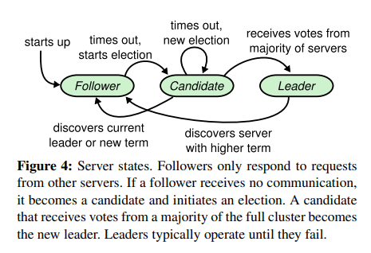
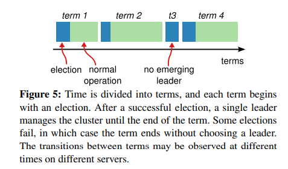

#####
Different servers may observe the transitions between terms at different times,
and in some situations a server may not observe an election or even entire terms. 
Terms act as a logical clock [14] in Raft, and they allow servers to detect obsolete information such as stale leaders.
Each server stores a current term number, which increases monotonically over time. 
Current terms are exchanged whenever servers communicate; 
if one server’s current term is smaller than the other’s, then it updates its current term to the larger value.
If a candidate or leader discovers that its term is out of date, it immediately reverts to follower state.
If a server receives a request with a stale term number, it rejects the request.
#####
不同服务器可能会在不同的时间上观察到任期之间的状态转换，并且在一些情况下一个服务器可能不会观察到一次选举甚至整个任期。
任期在Raft中充当逻辑时钟，并且它们允许服务器检测到过时的信息比如之前的、老leader。
每一个服务器存储了一个当前任期的编号，其随着时间单调增加。
每当服务器之间互相通信时，它们都会互相交换当前的任期(编号);如果一个服务器的当前任期(编号)小于其它的服务器，则其将会将当前的任期(编号)更新为那个更大的值。
如果一个candidate或者leader发现它们的任期(编号)已经过时，它将立即将自己恢复为follower的状态。
如果一个服务器接受到一个带有过时任期编号的请求，它将拒绝这一请求。

#####
Raft servers communicate using remote procedure calls(RPCs), and the basic consensus algorithm requires only two types of RPCs.
RequestVote RPCs are initiated by candidates during elections (Section 5.2), 
and AppendEntries RPCs are initiated by leaders to replicate log entries and to provide a form of heartbeat (Section 5.3).
Section 7 adds a third RPC for transferring snapshots between servers. 
Servers retry RPCs if they do not receive a response in a timely manner, and they issue RPCs in parallel for best performance.
#####
Raft服务器使用远过程调用(RPC)进行通信，并且基本的一致性算法只需要两种类型的RPC。
请求投票的RPC由candidate在选举期间发起(第5.2节)，拓展条目的RPC由leader发起，用于日志条目的复制以及提供心跳机制(第5.3节)。
第7节加入了第三种RPC用于在服务器间传输快照。
如果服务器在给定的时间内没有收到响应，则会对RPC进行重试，并且它们会发起并行的rpc以获得最好的性能。

### 5.2 Leader election(leader选举)
#####
Raft uses a heartbeat mechanism to trigger leader election. When servers start up, they begin as followers. 
A server remains in follower state as long as it receives valid RPCs from a leader or candidate. 
Leaders send periodic heartbeats (AppendEntries RPCs that carry no log entries) to all followers in order to maintain their authority.
If a follower receives no communication over a period of time called the election timeout, 
then it assumes there is no viable leader and begins an election to choose a new leader.
#####
Raft使用心跳机制来触发leader选举。当服务器启动时，它们会成为follower。
只要服务器能从leader或者candidate处接收到有效的RPC请求，它们就将保持follower状态。
leader向所有follower发送周期性的心跳(不携带日志条目的AppendEntries RPC)来维持它的权威性。
如果一个follower在一段被成为选举超时的时间段内未接收到任何通信，则它假设当前没有可用的leader并且发起选举来选择一个新的leader。

#####
To begin an election, a follower increments its current term and transitions to candidate state. 
It then votes for itself and issues RequestVote RPCs in parallel to each of the other servers in the cluster. 
A candidate continues in this state until one of three things happens:
(a) it wins the election, 
(b) another server establishes itself as leader, or
(c) a period of time goes by with no winner.
These outcomes are discussed separately in the paragraphs below.
#####
为了开始一轮选举，follower增加它当前的任期值并且转换为candidate状态。
然后它将选票投给它自己并且向集群中的其它服务器并行的发起请求投票的RPC(RequestVote RPCs)。
一个candidate会一直保持这种状态直到以下三种情况之一发生：
(a) 它赢得此次选举 (b) 另一个服务器将自己确认为leader，或者 (c) 一段时间后没有产生胜利者。
下文中的各个段落将分别讨论这些结果。

#####
A candidate wins an election if it receives votes from a majority of the servers in the full cluster for the same term. 
Each server will vote for at most one candidate in a given term, on a first-come-first-served basis
(note: Section 5.4 adds an additional restriction on votes). 
The majority rule ensures that at most one candidate can win the election for a particular term (the Election Safety Property in Figure 3).
Once a candidate wins an election, it becomes leader.
It then sends heartbeat messages to all of the other servers to establish its authority and prevent new elections.
#####
如果一个candidate在同一个任期内接收到了整个集群中大多数服务器的投票，其将赢得这次选举。
每个服务器在给定的某一任期内将会基于先来先服务的原则(first-come-first-served)投票给至多一位candidate(第5.4节对投票增加了额外的限制)。
多数规则确保了对于一个特定的任期，最多只会有一名candidate能够赢得选举(图3中选举的安全特性)。
一旦一个candidate赢得了一次选举，它将成为leader。
然后它向其它服务器发送心跳信息以建立权威并且阻止新的选举。

#####
While waiting for votes, a candidate may receive an AppendEntries RPC from another server claiming to be leader. 
If the leader’s term (included in its RPC) is at least as large as the candidate’s current term, 
then the candidate recognizes the leader as legitimate and returns to follower state. 
If the term in the RPC is smaller than the candidate’s current term, then the candidate rejects the RPC and continues in candidate state.
#####
在等待投票时，一个candidate可能会接受到来自自称是leader的其它服务器的AppendEntries RPC。
如果leader的任期(包含在它的RPC中)大于或等于candidate的当前任期，那么candidate承认该leader是合法的并且返回到follower状态。
如果RPC中的任期小于candidate的当前任期，candidate将会拒绝这一RPC并且继续保持candidate的状态。

#####
The third possible outcome is that a candidate neither wins nor loses the election:
if many followers become candidates at the same time, votes could be split so that no candidate obtains a majority.
When this happens, each candidate will time out and start a new election by incrementing its term 
and initiating another round of RequestVote RPCs.
However, without extra measures split votes could repeat indefinitely.
#####
第三种可能的结果是一个candidate既没有赢得选举也没有输掉选举：
如果许多follower都在同一时间成为了candidate，投票可能会被瓜分导致没有candidate获得大多数的选票。
当这种情况发生时，每一个candidate都将会超时并且通过增加它的任期值并且初始化另一轮的RequestVote RPCs以开始一轮新的选举。
然而，如果不采取额外的措施，分裂的投票可能会无限的重复。

#####
Raft uses randomized election timeouts to ensure that split votes are rare and that they are resolved quickly.
To prevent split votes in the first place, election timeouts are chosen randomly from a fixed interval (e.g., 150–300ms).
This spreads out the servers so that in most cases only a single server will time out; 
it wins the election and sends heartbeats before any other servers time out.
The same mechanism is used to handle split votes. 
Each candidate restarts its randomized election timeout at the start of an election, and it waits for that timeout to elapse before
starting the next election; this reduces the likelihood of another split vote in the new election. 
Section 9.3 shows that this approach elects a leader rapidly.
#####
Raft使用随机化的选举超时时间来确保分裂的投票很少会发生并使得它们能够被迅速的解决。
为了防止一开始就出现分裂的投票，选举的超时时间是从一个固定的间隔中被随机选取的(例如150-300ms)。
这打散了服务器使得在大多数情况下只有单独一个服务器将会超时；它赢得选举并且在其它服务器超时之前发送心跳(译者注：超时后自己就会在别的服务器没反应过来前发起新一轮任期更大的投票，让别人都投给它来赢得选举)。
同样的机制也被用于解决分裂的投票。
每个candidate在一轮选举开始时会重新随机的设置其选举超时时间，并且在下一轮选举前等待直到超时；这减少了在新的选举中再一次出现分裂投票的可能性。
第9.3节展示了该方法能迅速的选举出一个leader。

#####
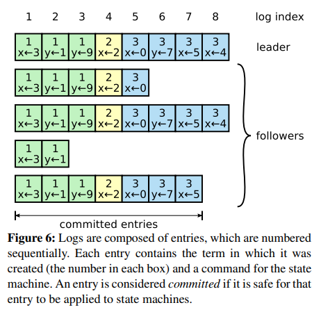

#####
Elections are an example of how understandability guided our choice between design alternatives. 
Initially we planned to use a ranking system: each candidate was assigned a unique rank, which was used to select between competing candidates.
If a candidate discovered another candidate with higher rank, 
it would return to follower state so that the higher ranking candidate could more easily win the next election. 
We found that this approach created subtle issues around availability 
(a lower-ranked server might need to time out and become a candidate again if a higher-ranked server fails,
but if it does so too soon, it can reset progress towards electing a leader). 
We made adjustments to the algorithm several times, but after each adjustment new corner cases appeared.
Eventually we concluded that the randomized retry approach is more obvious and understandable.
#####
选举是一个可理解性如何指导我们在可选设计间进行选择的例子。
最初，我们计划使用等级系统(ranking system)：每一个candidate都被分配一个唯一的等级，其用于在彼此竞争的candidate做选择。
如果一个candidate发现了一个具有更高等级的candidate，它将返回到follower状态因此更好等级的candidate将更容易赢得下一次选举。
但我们发现这个方法在可用性方面存在微妙的问题(如果一个高等级的服务器故障了，则一个低等级的服务器可能需要超时并再次成为candidate，但如果这样做的太早，它将会重置选举leader的进度)。
我们对算法进行了数次调整，但每次调整后都出现了新的困境。
最终我们得出结论，随机化重试的方法更显然且更容易被理解。

### 5.3 Log replication(日志复制)
#####
Once a leader has been elected, it begins servicing client requests. 
Each client request contains a command to be executed by the replicated state machines. 
The leader appends the command to its log as a new entry, 
then issues AppendEntries RPCs in parallel to each of the other servers to replicate the entry. 
When the entry has been safely replicated (as described below), 
the leader applies the entry to its state machine and returns the result of that execution to the client. 
If followers crash or run slowly, or if network packets are lost, 
the leader retries AppendEntries RPCs indefinitely (even after it has responded to the client) 
until all followers eventually store all log entries.
#####
一旦一个leader被选举出来，它将开始服务于客户端的请求。
每一个客户端的请求都包含了一个被用于在复制状态机上执行的指令。
leader将指令作为一个新的条目追加到其日志中，然后向其它的每个服务器发起并行的AppendEntries RPC令它们复制这一条目。
当条目已被安全的被复制(如下所述)，leader在它的状态机上应用这一条目并且将执行的结果返回给客户端。
如果follower崩溃了或者运行的很慢，或者网络失包，leader会无限的重试AppendEntries RPC(即使在响应了客户端的请求之后)，
直到所有的follower最终都存储了所有的日志条目。

#####
Logs are organized as shown in Figure 6. 
Each log entry stores a state machine command along with the term number when the entry was received by the leader.
The term numbers in log entries are used to detect inconsistencies between logs and to ensure some of the properties in Figure 3. 
Each log entry also has an integer index identifying its position in the log.
#####
日志如图6所示的方式被组织。
每一个日志条目存储了一个状态机的指令，以及从leader处接受条目时的任期编号。
日志条目中的任期编号被用于检测日志间的不一致，并且用于保证图3中的一些特性。
每个日志条目也有一个整数的索引标识其在日志中的位置。

#####
The leader decides when it is safe to apply a log entry to the state machines; such an entry is called committed.
Raft guarantees that committed entries are durable and will eventually be executed by all of the available state machines.
A log entry is committed once the leader that created the entry has replicated it on a majority of the servers (e.g., entry 7 in Figure 6).
This also commits all preceding entries in the leader’s log, including entries created by previous leaders. 
Section 5.4 discusses some subtleties when applying this rule after leader changes,
and it also shows that this definition of commitment is safe. 
The leader keeps track of the highest index it knows to be committed,
and it includes that index in future AppendEntries RPCs (including heartbeats) so that the other servers eventually find out. 
Once a follower learns that a log entry is committed, it applies the entry to its local state machine (in log order).
#####
leader决定何时能安全的在状态机上应用日志条目；这样的条目被称作已提交的日志。
Raft保证已提交的条目都会被持久化并且最终将会在所有可用的状态机上被执行。
一旦被创建的条目被大多数服务器所复制，leader就会将其提交(例如，图6中的条目7)。
同时也会提交leader日志中更早之前的所有条目，其中包括被前任leader们所创建的条目。
第5.4节讨论了在leader变更时应用这一规则的微妙之处，同时它也证明了所承诺的定义是安全的。
leader持续的跟踪它已知的被提交日志的最大索引值，并且将索引值包含在未来的AppendEntries RPC中(包括心跳)，以便其它的服务器最终能知道(最大编号的已提交索引)。
一旦一个follower知道一个日志条目已被提交，它便将这一条目应用于本地的状态机(基于日志的顺序)。

#####
We designed the Raft log mechanism to maintain a high level of coherency between the logs on different servers.
Not only does this simplify the system’s behavior and make it more predictable, but it is an important component of ensuring safety.
Raft maintains the following properties, which together constitute the Log Matching Property in Figure 3:
* If two entries in different logs have the same index and term, then they store the same command.
* If two entries in different logs have the same index and term, then the logs are identical in all preceding entries.
#####
我们设计了Raft日志机制，其用于维持不同服务器之间日志的高度一致。
其不仅仅简化了系统的行为，还使得它更加的可预测，同时这也是确保安全性的重要部分。
Raft维护着以下特性，这些特性一并组成了图3中的日志匹配特性(Log Matching Property)：
* 如果不同日志中的两个条目有着相同的索引值和任期，则它们存储着相同的指令。
* 如果不同日志中的两个条目有着相同的索引值和任期，则该日志之前的所有条目也都是完全相同的。

#####
The first property follows from the fact that a leader creates at most one entry with a given log index in a given term, 
and log entries never change their position in the log.
The second property is guaranteed by a simple consistency check performed by AppendEntries.
When sending an AppendEntries RPC, the leader includes the index and term of the entry in its log that immediately precedes the new entries. 
If the follower does not find an entry in its log with the same index and term, then it refuses the new entries. 
The consistency check acts as an induction step: the initial empty state of the logs satisfies the Log Matching Property,
and the consistency check preserves the Log Matching Property whenever logs are extended.
As a result, whenever AppendEntries returns successfully, 
the leader knows that the follower’s log is identical to its own log up through the new entries.
#####
第一个特性源自这样一个事实，即一个leader只会在特定任期内的某一索引值下最多只会创建一个条目，并且日志条目在日志中的位置是永远不会改变的。
第二个特性则由AppendEntries执行一个简单的一致性检查来保证。
当发送AppendEntries RPC时，leader将前一个条目的索引和任期包含在新条目中。
如果follower没有找到一个具有相同索引值和任期的日志条目，则它将拒绝这一新条目。
一致性检查就像一个归纳的步骤:初始化时的空状态满足日志匹配的特性(Log Matching Property)，并且每当扩展日志时，一致性检查都会维持日志匹配的特性。
因此，每当AppendEntries返回成功时，通过新的条目leader就知道follower的日志与leader自己的是完全一致的，

#####
During normal operation, the logs of the leader and followers stay consistent,
so the AppendEntries consistency check never fails. 
However, leader crashes can leave the logs inconsistent (the old leader may not have fully replicated all of the entries in its log). 
These inconsistencies can compound over a series of leader and follower crashes.
Figure 7 illustrates the ways in which followers’ logs may differ from that of a new leader.
A follower may be missing entries that are present on the leader, it may have extra entries that are not present on the leader, or both.
Missing and extraneous entries in a log may span multiple terms.
#####
在正常操作期间，leader和follower的日志始终保持一致，因此AppendEntries的一致性检查从来不会失败。
然而，leader奔溃会导致日志的不一致(老的leader可能没有将它所有的日志条目完全复制完成)。
这些不一致可能会随着一系列的leader和follower的崩溃而加剧。
图7说明了follower日志可能与新leader不同的方式。
一个Follower可能缺少了之前leader中才有的条目，也可能拥有一些在新leader中不存在的额外的条目，或者这两种方式皆有。
缺失的或者额外多出的条目可能涉及到多个任期。

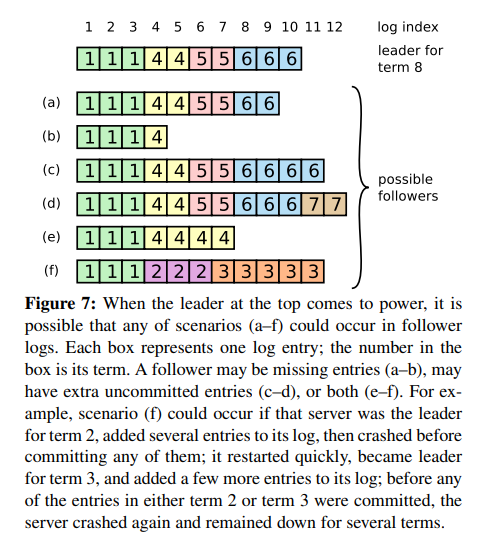

#####
In Raft, the leader handles inconsistencies by forcing the followers’ logs to duplicate its own. 
This means that conflicting entries in follower logs will be overwritten with entries from the leader’s log. 
Section 5.4 will show that this is safe when coupled with one more restriction.
#####
在Raft中，leader通过强制follower复制它的日志来处理不一致问题。
这意味着follower中存在冲突的日志条目将会被来自leader的日志给覆盖。
第5.4节将展示在加上一个限制时，这将会是安全的。

#####
To bring a follower’s log into consistency with its own, the leader must find the latest log entry where the two logs agree, 
delete any entries in the follower’s log after that point, and send the follower all of the leader’s entries after that point. 
All of these actions happen in response to the consistency check performed by AppendEntries RPCs.
The leader maintains a nextIndex for each follower, which is the index of the next log entry the leader will send to that follower. 
When a leader first comes to power, it initializes all nextIndex values to the index just after the last one in its log (11 in Figure 7). 
If a follower’s log is inconsistent with the leader’s, 
the AppendEntries consistency check will fail in the next AppendEntries RPC. 
After a rejection, the leader decrements nextIndex and retries the AppendEntries RPC.
Eventually nextIndex will reach a point where the leader and follower logs match.
When this happens, AppendEntries will succeed, 
which removes any conflicting entries in the follower’s log and appends entries from the leader’s log (if any). 
Once AppendEntries succeeds, the follower’s log is consistent with the leader’s, and it will remain that way for the rest of the term.
#####
为了使得follower的日志与自己的保持一致，leader必须找到两个日志中一致的条目中最新的那个，
删除follower日志中位于该点位之后的所有条目，并且将leader在该点位后的所有条目发送给follower。
所有的这些动作都发生在对AppendEntries RPC的一致性检查工作的响应中。
leader为每一个follower维护了一个nextIndex,这是leader将发送给follower的下一个日志条目的索引编号。
当leader第一次掌权时，其将所有的nextIndex的值初始化为其最后一个日志索引值再加1(图7中的11)。
如果follower的日志与leader的不一致，AppendEntries的一致性检查将会在下一次AppendEntries RPC中失败。
在一次拒绝后，leader将会递减nextIndex并且重试AppendEntries RPC。
最终nextIndex将会到达一个leader与follower的日志想匹配的点位。
当这一情况发生时，AppendEntries将会成功，其将删除follower日志中的所有冲突的条目并且追加来自leader日志中的条目(如果需要的话)。
一旦AppendEntries成功，follower的日志将会与leader一致，并且在本任期内接下来的时间内保持一致。

#####
If desired, the protocol can be optimized to reduce the number of rejected AppendEntries RPCs. 
For example, when rejecting an AppendEntries request, 
the follower can include the term of the conflicting entry and the first index it stores for that term.
With this information, the leader can decrement nextIndex to bypass all of the conflicting entries in that term; 
one AppendEntries RPC will be required for each term with conflicting entries, rather than one RPC per entry.
In practice, we doubt this optimization is necessary, 
since failures happen infrequently and it is unlikely that there will be many inconsistent entries.
#####
如果有需要的话，协议可以通过减少被拒绝的AppendEntries RPCs数量来进行优化。
例如，当一次AppendEntries请求被拒绝时，follower可以将包含对应任期的冲突条目和存储了对应任期的第一个索引值返回给leader。
有了这些信息，leader递减nextIndex来避开对应任期内的所有冲突的条目;对于每一个任期的冲突条目，将只需要一次AppendEntries RPC，而不是一次RPC(处理)一个条目。
在实践中，我们怀疑这一优化是否是必要的，因为很少发生故障并且不太可能有很多不一致的条目。

#####
With this mechanism, a leader does not need to take any special actions to restore log consistency when it comes to power. 
It just begins normal operation, and the logs automatically converge in response to failures of the AppendEntries consistency check. 
A leader never overwrites or deletes entries in its own log (the Leader Append-Only Property in Figure 3).
#####
有了这一机制，leader将不需要在掌权时使用任何特别的方法来恢复日志的一致性。
它只是开始进行正常的操作，日志便会在响应AppendEntries的一致性检查时自动的趋于一致。
leader从来不会覆盖或者删除它自己的日志(图3中leader的Append-Only特性)。

#####
This log replication mechanism exhibits the desirable consensus properties described in Section 2: 
Raft can accept, replicate, and apply new log entries as long as a majority of the servers are up; 
in the normal case a new entry can be replicated with a single round of RPCs to a majority of the cluster; 
and a single slow follower will not impact performance.
#####
这一日志复制机制展示了第2节中所描述的理想的一致性特性。
只要大多数服务器是在线的，Raft便能接收，复制并且应用新的日志条目；
在正常情况下一个新的条目可以通过单轮的RPC复制到集群中的大多数服务器上;并且单独的慢速的follower将不会影响性能。

### 5.4 Safety(安全性)
The previous sections described how Raft elects leaders and replicates log entries. 
However, the mechanisms described so far are not quite sufficient to ensure 
that each state machine executes exactly the same commands in the same order.
For example, a follower might be unavailable while the leader commits several log entries,
then it could be elected leader and overwrite these entries with new ones; 
as a result, different state machines might execute different command sequences.
#####
前面的章节描述了Raft是如何选举leader和复制日志条目的。
然而，目前为止已描述的机制还不足以确保每一个状态机以相同的顺序准确地执行相同的指令。
例如，当leader提交了几个日志条目后一个follower可能会变得不可用，随后follower可以被选举为leader并且用新的条目覆盖这些条目；
因此，不同的状态机可能会执行不同的指令序列。

#####
This section completes the Raft algorithm by adding a restriction on which servers may be elected leader.
The restriction ensures that the leader for any given term contains all of the entries committed in previous terms 
(the Leader Completeness Property from Figure 3). 
Given the election restriction, we then make the rules for commitment more precise.
Finally, we present a proof sketch for the Leader Completeness Property 
and show how it leads to correct behavior of the replicated state machine.
#####
这一节通过增加一个对哪些服务器可以被选举为leader的限制来完善Raft算法。
该限制确保leader对于给定的任期，其包含了所有之前任期的已提交条目（图3中的leader Completeness特性）。
有了选举的限制，我们也使得关于提交的规则变得更加清晰。
最后，我们给出了关于Leader Completeness的简要证明，并且展示了它是如何让复制状态机执行正确行为的。

### 5.4.1 Election restriction(选举限制)
In any leader-based consensus algorithm, the leader must eventually store all of the committed log entries. 
In some consensus algorithms, such as Viewstamped Replication [22], 
a leader can be elected even if it doesn’t initially contain all of the committed entries. 
These algorithms contain additional mechanisms to identify the missing entries and transmit them to the new leader,
either during the election process or shortly afterwards.
Unfortunately, this results in considerable additional mechanism and complexity. 
Raft uses a simpler approach where it guarantees 
that all the committed entries from previous terms are present on each new leader from the moment of its election, 
without the need to transfer those entries to the leader.
This means that log entries only flow in one direction, from leaders to followers,
and leaders never overwrite existing entries in their logs.
#####
在任何基于leader的一致性算法中，leader必须最终存储所有已提交的日志条目。
在一些一致性算法中，例如Viewstamped Replication，一个leader即使最初不包含所有已提交的条目也能被选举为leader。
这些算法包含了额外的机制来识别缺失的条目并在选举过程中或选举后不久将其传输给新的leader。
不幸的是，这带来了非常多的额外机制和复杂性。
Raft使用了一种更简单的方法来确保每一个新的leader当选时都拥有之前任期的所有已提交的条目，而无需传输这些条目给leader。
这意味着日志条目只会单方向的从leader向follower流动，并且leader从不覆盖它们已存在的条目。

#####
Raft uses the voting process to prevent a candidate from winning an election unless its log contains all committed entries.
A candidate must contact a majority of the cluster in order to be elected, 
which means that every committed entry must be present in at least one of those servers. 
If the candidate’s log is at least as up-to-date as any other log in that majority 
(where “up-to-date” is defined precisely below), then it will hold all the committed entries. 
The RequestVote RPC implements this restriction: the RPC includes information about the candidate’s log, 
and the voter denies its vote if its own log is more up-to-date than that of the candidate.
#####
Raft使用投票机制来防止不包含所有已提交条目的candidate赢得选举。
一个candidate必须与集群中的大多数成员联系后才能当选，这意味着每个提交的条目必须至少存在于其中的至少一个服务器中。
如果candidate的日志至少和其它大多数的日志一样新(何为"最新"(up-to-date)将在下面被定义)，则它将持有所有已提交的条目。
RequestVote RPC中实现了之一限制：RPC包括了candidate的日志信息，并且如果candidate的日志不如投票人(voter)的日志新，则voter将拒绝投票给该candidate。

#####
Raft determines which of two logs is more up-to-date by comparing the index and term of the last entries in the logs. 
If the logs have last entries with different terms, then the log with the later term is more up-to-date.
If the logs end with the same term, then whichever log is longer is more up-to-date.
#####
Raft通过比较两个日志中最后一个条目的索引和任期来决定谁是最新的。
如果两个日志中最后的条目有着不同的任期，则任期较后的日志是更新的。
如果两个日志中最后的条目有着相同的任期，则较长的(注：索引值更大的)那个日志是更新的。

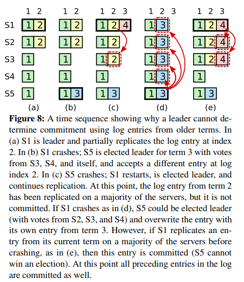

### 5.4.2 Committing entries from previous terms
As described in Section 5.3, a leader knows that an entry from its current term is committed once
that entry is stored on a majority of the servers. 
If a leader crashes before committing an entry, future leaders will attempt to finish replicating the entry. 
However, a leader cannot immediately conclude that an entry from a previous term is committed once it is stored on a majority of servers. 
Figure 8 illustrates a situation where an old log entry is stored on a majority of servers, 
yet can still be overwritten by a future leader.
#####
如5.3节所描述的那样，leader一旦知道当前任期内的一个条目被存储在了大多数的服务器中，就会将其提交。
如果leader在提交一个条目前崩溃了，未来的leader将试图去完成该条目的复制。
然而，leader无法立即得出结论，即一个来自之前任期的条目一旦被大多数服务器所存储就是已被提交的。
图8展示了这样一种情况，一个老的日志条目被存储在了大多数的服务器上，但任然被未来的leader覆盖掉了。

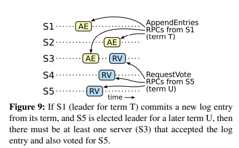
#####
To eliminate problems like the one in Figure 8, Raft never commits log entries from previous terms by counting replicas.
Only log entries from the leader’s current term are committed by counting replicas;
once an entry from the current term has been committed in this way,
then all prior entries are committed indirectly because of the Log Matching Property. 
There are some situations where a leader could safely conclude that an older log entry is committed 
(for example, if that entry is stored on every server), but Raft takes a more conservative approach for simplicity.
#####
为了消除像图8中那样的问题，Raft从来不基于副本数量来提交来自之前任期的日志条目。
只有来自leader当前任期的日志条目才基于副本数量被提交，一旦一个来自当前任期的条目以这种方式被提交，则所有之前的条目都将由于Log Matching特性而间接的被提交。
在一些情况下，leader可以安全的断定一个之前的log已经被提交(比如，如果一个entry已经被存储在每一个服务器上了)，但为了简单起见，Raft采取了一种更保守的方法。

#####
Raft incurs this extra complexity in the commitment rules because log entries retain their original term numbers
when a leader replicates entries from previous terms. 
In other consensus algorithms, if a new leader re-replicates entries from prior “terms,” it must do so with its new “term number.”
Raft’s approach makes it easier to reason about log entries, since they maintain the same term number over time and across logs.
In addition, new leaders in Raft send fewer log entries from previous terms
than in other algorithms (other algorithms must send redundant log entries to renumber them before they can be committed).
#####
Raft向提交规则中引入了额外的复杂性，因为当leader复制来自之前任期的条目时，这些日志条目会保留它原始的任期编号。
在其它一致性算法中，如果一个新的leader要重新复制来自之前任期的条目，它必须使用新的任期编号。
Raft的方法使得更容易理解日志条目，因为它们在不同服务器的日志中自始至终保留了相同的任期编号。
额外的，相比其它算法，raft中的新leader会发送更少的来自之前任期的日志条目(其它算法必须发送冗余的日志条目以对让对应的日志条目在提交前重新进行编号)。

### 5.4.3 Safety argument(安全性参数)
Given the complete Raft algorithm, 
we can now argue more precisely that the Leader Completeness Property holds (this argument is based on the safety proof; see Section 9.2). 
We assume that the Leader Completeness Property does not hold, then we prove a contradiction.
Suppose the leader for term T (leaderT) commits a log entry from its term, but that log entry is not stored by the leader of some future term.
Consider the smallest term U > T whose leader (leaderU) does not store the entry.
#####
在给出了完整的Raft算法后，我们可以更加准确的讨论leader的完整性(Completeness)特性是否成立了(这一讨论基于9.2节的安全性证明)。
我们假设leader的Completeness特性不成立，则我们可以推到出矛盾来。
假设任期T的leader(leaderT)提交了一个来自当前任期的日志条目，但该日志条目没有被未来某些任期的leader所存储。
考虑一个大于T的最小任期U，其leader(leaderU)没有存储这个条目。

#####
1. The committed entry must have been absent from leaderU’s log at the time of its election (leaders never delete or overwrite entries).
2. leaderT replicated the entry on a majority of the cluster, and leaderU received votes from a majority of the cluster. 
   Thus, at least one server (“the voter”) both accepted the entry from leaderT and voted for leaderU, as shown in Figure 9. 
   The voter is key to reaching a contradiction.
3. The voter must have accepted the committed entry from leaderT before voting for leaderU; 
   otherwise it would have rejected the AppendEntries request from leaderT (its current term would have been higher than T).
4. The voter still stored the entry when it voted for leaderU, since every intervening leader contained the entry (by assumption), 
   leaders never remove entries, and followers only remove entries if they conflict with the leader.
5. The voter granted its vote to leaderU, so leaderU’s log must have been as up-to-date as the voter’s. 
   This leads to one of two contradictions.
6. First, if the voter and leaderU shared the same last log term, 
   then leaderU’s log must have been at least as long as the voter’s, so its log contained every entry in the voter’s log. 
   This is a contradiction, since the voter contained the committed entry and leaderU was assumed not to.
7. Otherwise, leaderU’s last log term must have been larger than the voter’s. 
   Moreover, it was larger than T, since the voter’s last log term was at least T (it contains the committed entry from term T). 
   The earlier leader that created leaderU’s last log entry must have contained the committed entry in its log (by assumption).
   Then, by the Log Matching Property, leaderU’s log must also contain the committed entry, which is a contradiction.
8. This completes the contradiction. Thus, the leaders of all terms greater than T must contain all entries from term T
   that are committed in term T.
9. The Log Matching Property guarantees that future leaders will also contain entries that are committed indirectly,
   such as index 2 in Figure 8(d).
#####
1. 已提交的条目在leaderU当选时，必须不在leaderU的日志中(leader从来不会删除或者覆盖条目)。
2. leaderT将对应条目复制到了集群中的大多数(服务器)中,并且leaderU获得了来自集群中的大多的选票。
   因此，至少有一个服务器(作为voter)同时接收到了来自leaderT的条目并且投票给了leaderU.如图9所示。该voter是达成矛盾的关键所在。
3. voter必须在投票给leaderU之前接受来自leaderT的已提交的条目;
   否则其将拒绝来自leaderT的AppendEntries request(它当前的任期将已经高于T)。
4. voter在投票给leaderU时依然存储了该条目，因为每一个介于其中的leader(任期位于T和U之间)都包含了该条目，
   leader从不移除条目，并且follower只移除与leader相冲突的条目。
5. voter同意投票给leaderU,因此leaderU的日志必须至少与voter是一样新的。这带来了以下两个矛盾中的一个。
6. 首先，如果voter和leaderU的最后一个日志有着相同的任期，则leaderU的日志必须至少与voter一样长，
   因此leaderU的日志包含了voter日志中的每一个条目。
   这是矛盾的，因为voter包含了已提交的条目而leaderU被假设为没有包含。
7. 否则leaderU的最后一个日志的任期就必须比voter要大了。
   此外，任期的值也大于T，因为voter的最后一个日志的任期至少是T(其包含了来自任期T的所有已提交条目)。
   创建leaderU最后一个日志条目的更早的leader也必须包含这个日志(假设)。
   然后，基于Log Matching特性，leaderU的日志必须也包含已提交的条目，这是一个矛盾。
8. 这就终结了矛盾。因此，所有任期大于T的leader必须包含所有的任期T内的已提交条目。
9. Log Matching特性保证了未来的leader也包含间接提交的日志，就像图8中的索引2。

#####
Given the Leader Completeness Property, we can prove the State Machine Safety Property from Figure 3,
which states that if a server has applied a log entry at a given index to its state machine, 
no other server will ever apply a different log entry for the same index.
At the time a server applies a log entry to its state machine, 
its log must be identical to the leader’s log up through that entry and the entry must be committed.
Now consider the lowest term in which any server applies a given log index;
the Log Completeness Property guarantees that the leaders for all higher terms will store that same log entry, 
so servers that apply the index in later terms will apply the same value.
Thus, the State Machine Safety Property holds.
#####
通过Leader Completeness特性，我们可以证明来自图3的State Machine Safety(安全状态机)特性，
如果服务器将给定索引日志条目作用于状态机，其它的服务器将不能在相同的索引处应用不同的日志条目。
一旦服务器应用了一个日志条目到其状态机上，其日志必须与传递该条目的leader的日志完全一样，并且这个条目必须被提交。
现在考虑任一服务器应用给定日志索引的最小任期，Log Completeness特性保证了所有更高任期的leader将存储相同的日志条目，所以服务器在最晚任期所应用的索引将作用于相同的值。
因此，State Machine Safety特性是成立的。

#####
Finally, Raft requires servers to apply entries in log index order. 
Combined with the State Machine Safety Property, 
this means that all servers will apply exactly the same set of log entries to their state machines, in the same order.
#####
最后，Raft要求服务器按照日志索引的顺序应用日志条目。
结合State Machine Safety特性，这意味着所有的服务器将精确的以相同的顺序为它们的状态机应用一个相同的日志条目集合。

### 5.5 Follower and candidate crashes(follower和candidate崩溃)
Until this point we have focused on leader failures. 
Follower and candidate crashes are much simpler to handle than leader crashes, and they are both handled in the same way. 
If a follower or candidate crashes, then future RequestVote and AppendEntries RPCs sent to it will fail. 
Raft handles these failures by retrying indefinitely; if the crashed server restarts, then the RPC will complete successfully. 
If a server crashes after completing an RPC but before responding, then it will receive the same RPC again after it restarts. 
Raft RPCs are idempotent, so this causes no harm. 
For example, if a follower receives an AppendEntries request that includes log entries already present in its log, 
it ignores those entries in the new request.
#####
在此之前我们一直聚焦于leader出故障的情况。
follower和candidate的崩溃比起leader的崩溃会更加容易处理，并且它们都以相同的方式被处理。
如果一个follower或者candidate崩溃了，则未来发送给它的投票请求(RequestVote)和AppendEntries RPC的发送将会失败。
Raft通过无限的重试来处理这些失败，如果已崩溃的服务器重启了，则RPC将会成功的完成。
如果服务器在完成了一个RPC但是在进行响应之前崩溃了，则它将会在重启后再一次接受到相同的RPC。
Raft的RPC是幂等的，所以这不会有问题。
例如，如果一个follower接受到的一个AppendEntries请求中包含的日志条目已经在它自己的日志中了，该follower就会在这次新的请求中忽略掉这些条目。

##### 5.6 Timing and availability(时间和可用性)
One of our requirements for Raft is that safety must not depend on timing: 
the system must not produce incorrect results just because some event happens more quickly or slowly than expected. 
However, availability (the ability of the system to respond to clients in a timely manner) must inevitably depend on timing. 
For example, if message exchanges take longer than the typical time between server crashes,
candidates will not stay up long enough to win an election; without a steady leader, Raft cannot make progress.
#####
我们对Raft的要求之一是安全性不得依赖时间：系统不能因为一些事件比所期望的更快或更慢发生而产生不正确的结果。
然而，可用性(系统及时响应客户端的能力)一定不可避免的依赖于时间。
例如，如果消息交换所花费的时间比服务器崩溃时所花费的时间还长，candidates将无法一直等待以赢得一场选举；没有一个稳定的leader，Raft就无法工作。

#####
Leader election is the aspect of Raft where timing is most critical.
Raft will be able to elect and maintain a steady leader as long as the system satisfies the following timing requirement:
broadcastTime ≪ electionTimeout ≪ MTBF
#####
leader选举是Raft关于时间的最关键的方面。
只要系统能满足以下时间的需求，Raft将能够选出并且维持一个稳定的leader：
广播时间(broadcastTime) ≪ 选举超时时间(electionTimeout) ≪ 平均故障间隔时间(MTBF: Mean Time between Failures)

#####
In this inequality broadcastTime is the average time it takes a server to send RPCs in parallel to every server
in the cluster and receive their responses; 
electionTimeout is the election timeout described in Section 5.2; 
and MTBF is the average time between failures for a single server. 
The broadcast time should be an order of magnitude less than the election timeout so
that leaders can reliably send the heartbeat messages required to keep followers from starting elections; 
given the randomized approach used for election timeouts, this inequality also makes split votes unlikely.
The election timeout should be a few orders of magnitude less than MTBF so that the system makes steady progress.
When the leader crashes, the system will be unavailable for roughly the election timeout;
we would like this to represent only a small fraction of overall time.
#####
在这个不等式中，广播时间是服务器并行发送RPC给集群中的每一个服务器并且接受到它们的响应所花费的时间；
选举超时时间是在5.2节中所描述的选举超时时间；同时MTBF是对于单一服务器在两次故障间隔的平均时间。
广播时间应该比选举超时时间小一个数量级因此leader可以可靠的发送所需的心跳信息来阻止follower开始选举；
考虑到用于选举超时的随机化风阀，这个不等式也使得不太可能出现投票分裂。
选举超时时间必须比MTBF低几个数量级才能使得系统能稳定的运行。
当leader崩溃时，系统将有大致等于选举超时时间左右的不可用时间，我们希望这只占用整个(工作)时间的一小部分。

#####
The broadcast time and MTBF are properties of the underlying system, while the election timeout is something we must choose. 
Raft’s RPCs typically require the recipient to persist information to stable storage, 
so the broadcast time may range from 0.5ms to 20ms, depending on storage technology.
As a result, the election timeout is likely to be somewhere between 10ms and 500ms. 
Typical server MTBFs are several months or more, which easily satisfies the timing requirement.
#####
广播时间和平均故障间隔时间是底层系统的特性，只有选举超时时间是我们必须选择的。
Raft的RPC通常需要接收方将信息持久化到稳定的存储介质中，所以广播时间可能在0.5ms到20ms之间，这取决于存储技术。
因此，选举时间可能在10ms到500ms之间。
典型的服务器平均故障间隔时间是几个月或者更多，因此对这一时间(的要求)很容易满足。

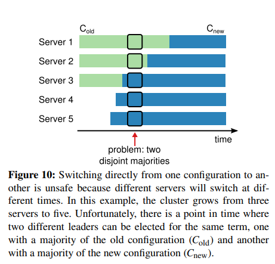

### 6 Cluster membership changes(集群成员变更)
Up until now we have assumed that the cluster configuration (the set of servers participating in the consensus algorithm) is fixed.
In practice, it will occasionally be necessary to change the configuration, 
for example to replace servers when they fail or to change the degree of replication.
Although this can be done by taking the entire cluster off-line, updating configuration files,
and then restarting the cluster, this would leave the cluster unavailable during the changeover. 
In addition, if there are any manual steps, they risk operator error.
In order to avoid these issues, we decided to automate configuration changes and incorporate them into the Raft consensus algorithm.
#####
到目前为止，我们已经假设集群的配置(参与一致性算法的服务器集合)是固定的。
在实践中，偶尔的改变配置是必须的，例如在服务器发生故障时进行替换或者改变复制的程度。
尽管这可以通过使整个集群离线，更新配置文件并且随后重启集群来实现，但这也使得集群在转换过程中变得不可用。
另外，如果有任何的手工步骤，则有管理员操作失误的风险。
为了避免这些问题，我们决定将配置的变更自动化并且将其纳入到Raft一致性算法中。

#####
For the configuration change mechanism to be safe,
there must be no point during the transition where it is possible for two leaders to be elected for the same term. 
Unfortunately, any approach where servers switch directly from the old configuration to the new configuration is unsafe.
It isn’t possible to atomically switch all of the servers at once, 
so the cluster can potentially split into two independent majorities during the transition (see Figure 10).
#####
为了使得配置变更的过程是安全的，在转换的过程中必须保证不能在同一个任期内选举出两个leader。
不幸的是，任何将旧配置直接切换到新配置的方法都是不安全的。
不可能原子性的一次性切换所有的服务器，因此服务器可能在转换期间被切分为两个独立的多数(如图10所示)。

#####
In order to ensure safety, configuration changes must use a two-phase approach. 
There are a variety of ways to implement the two phases. 
For example, some systems(e.g., [22]) use the first phase to disable the old configuration so it cannot process client requests; 
then the second phase enables the new configuration.
In Raft the cluster first switches to a transitional configuration we call joint consensus;
once the joint consensus has been committed, the system then transitions to the new configuration. 
The joint consensus combines both the old and new configurations:

* Log entries are replicated to all servers in both configurations.
* Any server from either configuration may serve as leader
* Agreement (for elections and entry commitment) requires separate majorities from both the old and new configurations.

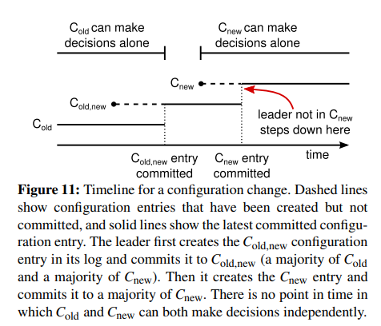
#####
为了确保安全，配置的变更必须使用一种两阶段的方法。
有很多方法可以实现两阶段。
例如，一些系统通过在一阶段禁用旧的配置因此其无法处理客户端请求，然后二阶段则启用新的配置。
在Raft的集群首先切换到我们成为联合一致(joint consensus)的过渡配置;一旦联合一致已被提交，系统便过度到新的配置。
联合一致结合了旧的和新的配置：
* 日志条目都会被复制到在这两种配置中所有的服务器上。
* 新、旧配置中的任一服务器都可以作为leader。
* (对于选举和条目提交)达成一致需要在新的和旧的配置中分别获得大多数服务器的同意。

#####
The joint consensus allows individual servers to transition between configurations at different times without compromising safety.
Furthermore, joint consensus allows the cluster to continue servicing client requests throughout the configuration change.
#####
联合一致允许单独的服务器在不同的时间内转换配合而不会在安全性上有所妥协。
此外，联合一致允许集群在配置变更的过程中持续的为客户端的请求提供服务。

#####
Cluster configurations are stored and communicated using special entries in the replicated log;
Figure 11 illustrates the configuration change process.
When the leader receives a request to change the configuration from C*old* to C*new*, 
it stores the configuration for joint consensus(C*old,new* in the figure) as a log entry and replicates that
entry using the mechanisms described previously.
Once a given server adds the new configuration entry to its log, it uses that configuration for all future decisions 
(a server always uses the latest configuration in its log, regardless of whether the entry is committed). 
This means that the leader will use the rules of C*old,new* to determine when the log entry for C*old,new* is committed.
If the leader crashes, a new leader may be chosen under either C*old* or C*old,new*,
depending on whether the winning candidate has received C*old,new*. 
In any case, C*new* cannot make unilateral decisions during this period.
#####
集群配置通过复制日志中特殊的条目进行存储和通信；图11展示了配置变更的过程。
当leader接受到令配置从C*old*(旧配置)到C*new*(新配置)的请求时，
它为了联合一致以一个日志条目的形式存储这个配置(图中的C*old,new*)并且使用之前所描述的机制复制这个条目。
一旦给定的服务器将新的配置条目加入了它的日志，它将使用这些配置来指定未来所有的决定(一个服务器总是使用它日志中最后的配置，无论该条目是否是已提交的)。
这意味着leader将使用规则C*old,new*来决定何时提交关于C*old,new*的日志条目。
如果leader崩溃了，新的leader可能是在C*old*或者是C*old,new*下选择出来的，这取决于获胜的candidate是否已经收到了C*old,new*。
无论如何，C*new*都不能在这个阶段单独的做出决定。

#####
Once C*old,new* has been committed, neither C*old* nor C*new* can make decisions without approval of the other, 
and the Leader Completeness Property ensures that only servers with the C*old,new* log entry can be elected as leader.
It is now safe for the leader to create a log entry describing C*new* and replicate it to the cluster.
Again, this configuration will take effect on each server as soon as it is seen. 
When the new configuration has been committed under the rules of C*new*, 
the old configuration is irrelevant and servers not in the new configuration can be shut down. 
As shown in Figure 11, there is no time when C*old* and C*new* can both make unilateral decisions; this guarantees safety.
#####
一旦C*old,new*已经提交，C*old*或者C*new*都不能在没有另一方同意的情况下做出决定，
并且Leader Completeness特性确保只有拥有C*old,new*日志条目的服务器才能被选举为leader。
现在leader可以安全的创建一个描述了C*new*的日志条目并将其在集群中进行复制。
同样的，该配置将在每一个服务器看到其后立即生效。
当新的配置在C*new*的规则下被提交，旧的配置将变得无关紧要并且没有在新配置中的服务器将可以被关闭。
如图11所示，C*old*和C*new*不能同时做出单独的决定；这保证了安全性。

#####
There are three more issues to address for reconfiguration. 
The first issue is that new servers may not initially store any log entries.
If they are added to the cluster in this state, it could take quite a while for them to catch up,
during which time it might not be possible to commit new log entries.
In order to avoid availability gaps, Raft introduces an additional phase before the configuration change, 
in which the new servers join the cluster as non-voting members
(the leader replicates log entries to them, but they are not considered for majorities). 
Once the new servers have caught up with the rest of the cluster, the reconfiguration can proceed as described above.
#####
关于配置变更还存在三个问题需要解决。
第一个问题是，新的服务器可能在初始化时没有存储任何的日志条目。
如果在这种状态下被加入到集群，它可能需要花费很长一段时间才能赶上，在这段时间内都无法提交新的日志条目。
为了避免可用性的差距，Raft在配置变更前引入了一个额外的阶段，新的服务器以无投票权成员(non-voting members)的身份加入集群
(leader复制日志条目给它们，但它们不被认为是大多数的一份子)。
一旦新的服务器能够追上集群中的其它机器，就可以向上述那般执行配置变更。

#####
The second issue is that the cluster leader may not be part of the new configuration.
In this case, the leader steps down (returns to follower state) once it has committed the C*new* log entry.
This means that there will be a period of time (while it is committing C*new*) 
when the leader is managing a cluster that does not include itself; it replicates log entries but does not count itself in majorities.
The leader transition occurs when C*new* is committed
because this is the first point when the new configuration can operate independently (it will always be possible to choose a leader from C*new*).
Before this point, it may be the case that only a server from C*old* can be elected leader.
#####
第二个问题是，集群的leader可能不是新配置中的一员。
在这种情况下，一旦C*new*日志条目被提交，leader将会退下(返回到follower状态)。
这意味着存在一段时间(在提交C*new*时)，其中leader管理者一个不包含自己的集群；它复制着日志条目但不把它自己算作大多数中的一员。
当C*new*被提交时将会发生leader的切换，因为这是新配置可以进行独立操作的第一个点位(总是可以在C*new*中选择出一个leader)。
在此之前，只有来自C*old*的服务器才有可能被选举为leader。

#####
The third issue is that removed servers (those not in C*new*) can disrupt the cluster. 
These servers will not receive heartbeats, so they will time out and start new elections.
They will then send RequestVote RPCs with new term numbers, and this will cause the current leader to revert to follower state. 
A new leader will eventually be elected, but the removed servers will time out again and the process will repeat, 
resulting in poor availability.
#####
第三个问题是被移除的服务器(不在C*new*中)可能会中断集群。
这些服务器将不再接收到心跳，所以它们将会超时而启动新的选举。
然后它们将发送有着新任期编号的RequestVote RPC，并且这将导致当前的leader恢复为follower状态。
最终将会有一名新的leader被选举出来，但是被移除的服务器将会再次超时并且重复这一过程，这将导致系统有着较差的可用性。

#####
To prevent this problem, servers disregard RequestVote RPCs when they believe a current leader exists.
Specifically, if a server receives a RequestVote RPC within the minimum election timeout of hearing from a current leader, 
it does not update its term or grant its vote. 
This does not affect normal elections, where each server waits at least a minimum election timeout before starting an election. 
However, it helps avoid disruptions from removed servers: 
if a leader is able to get heartbeats to its cluster, then it will not be deposed by larger term numbers.
#####
为了避免这一问题，服务器将会在它们认为当前leader存在时忽略掉RequestVote RPC。
特别的，如果一个服务器在当前leader最小的选举超时时间内接收到一个RequestVote RPC，它将不会更新它的任期或者发起投票。
这不会影响正常的选举，即每一个服务器在开始一轮选举之前至少等待一个最小的选举超时时间。
然而，它有助于避免移除服务器时的混乱：如果一个leader能够提供集群中的心跳，则它将不会被一个更大的任期编号给取代。

### 7 Log compaction(日志压缩)
Raft’s log grows during normal operation to incorporate more client requests, but in a practical system, it cannot grow without bound. 
As the log grows longer, it occupies more space and takes more time to replay. 
This will eventually cause availability problems without some mechanism to discard obsolete information that has accumulated in the log.
#####
Raft的日志在正常操作期间不断增长以满足更多的客户端请求，但是在实际的系统中，日志不能不加限制的增长。
随着日志不断变长，它将占用更多的空间并且花费更长的事件来进行回放。
如果没有一些机制来剔除日志中所累积的过时的信息，这终将造成可用性问题。

#####
Snapshotting is the simplest approach to compaction.
In snapshotting, the entire current system state is written to a snapshot on stable storage, 
then the entire log up to that point is discarded. Snapshotting is used in Chubby and ZooKeeper, 
and the remainder of this section describes snapshotting in Raft.

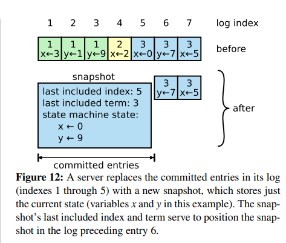

#####
Incremental approaches to compaction, such as log cleaning [36] and log-structured merge trees [30, 5], are also possible. 
These operate on a fraction of the data at once, so they spread the load of compaction more evenly over time. 
They first select a region of data that has accumulated many deleted and overwritten objects, 
then they rewrite the live objects from that region more compactly and free the region.
This requires significant additional mechanism and complexity compared to snapshotting,
which simplifies the problem by always operating on the entire data set. While log cleaning would require modifications to Raft, 
state machines can implement LSM trees using the same interface as snapshotting.

#####
Figure 12 shows the basic idea of snapshotting in Raft.
Each server takes snapshots independently, covering just the committed entries in its log. 
Most of the work consists of the state machine writing its current state to the snapshot.
Raft also includes a small amount of metadata in the snapshot: 
the _last included index_ is the index of the last entry in the log that the snapshot replaces 
(the last entry the state machine had applied), and the _last included term_ is the term of this entry. 
These are preserved to support the AppendEntries consistency check for the first log entry following the snapshot,
since that entry needs a previous log index and term. 
To enable cluster membership changes (Section 6), the snapshot also includes the latest configuration in the log as of last included index.
Once a server completes writing a snapshot, it may delete all log entries up through the last included index, as well as any prior snapshot

#####
Although servers normally take snapshots independently, the leader must occasionally send snapshots to followers that lag behind.
This happens when the leader has already discarded the next log entry that it needs to send to a follower. 
Fortunately, this situation is unlikely in normal operation: a follower that has kept up with the leader would already have this entry. 
However, an exceptionally slow follower or a new server joining the cluster(Section 6) would not.
The way to bring such a follower up-to-date is for the leader to send it a snapshot over the network.

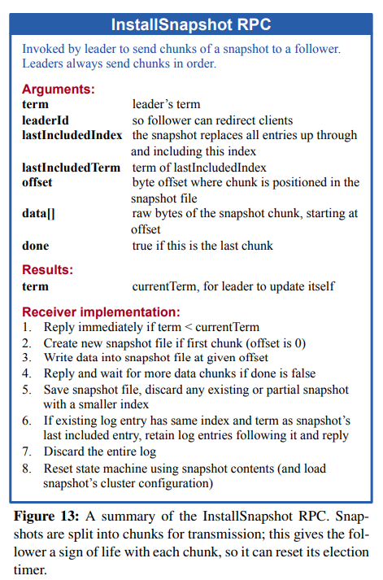

#####
The leader uses a new RPC called InstallSnapshot to send snapshots to followers that are too far behind; see Figure 13. 
When a follower receives a snapshot with this RPC, it must decide what to do with its existing log entries.
Usually the snapshot will contain new information not already in the recipient’s log. 
In this case, the follower discards its entire log; it is all superseded by the snapshot 
and may possibly have uncommitted entries that conflict with the snapshot.
If instead the follower receives a snapshot that describes a prefix of its log (due to retransmission or by mistake), 
then log entries covered by the snapshot are deleted but entries following the snapshot are still valid and must be retained.

#####
This snapshotting approach departs from Raft’s strong leader principle, since followers can take snapshots without the knowledge of the leader.
However, we think this departure is justified.
While having a leader helps avoid conflicting decisions in reaching consensus, 
consensus has already been reached when snapshotting, so no decisions conflict.
Data still only flows from leaders to followers, just followers can now reorganize their data.

#####
We considered an alternative leader-based approach in which only the leader would create a snapshot,
then it would send this snapshot to each of its followers.
However, this has two disadvantages.
First, sending the snapshot to each follower would waste network bandwidth and slow the snapshotting process. 
Each follower already has the information needed to produce its own snapshots, 
and it is typically much cheaper for a server to produce a snapshot from its local state than it is to send and receive one over the network.
Second, the leader’s implementation would be more complex. 
For example, the leader would need to send snapshots to followers in parallel with replicating new log entries to them,
so as not to block new client requests.

#####
There are two more issues that impact snapshotting performance. 
First, servers must decide when to snapshot. 
If a server snapshots too often, it wastes disk bandwidth and energy; if it snapshots too infrequently, 
it risks exhausting its storage capacity, and it increases the time required to replay the log during restarts.
One simple strategy is to take a snapshot when the log reaches a fixed size in bytes.
If this size is set to be significantly larger than the expected size of a snapshot, 
then the disk bandwidth overhead for snapshotting will be small.

#####
The second performance issue is that writing a snapshot can take a significant amount of time, 
and we do not want this to delay normal operations.
The solution is to use copy-on-write techniques so that new updates can be accepted without impacting the snapshot being written.
For example, state machines built with functional data structures naturally support this. 
Alternatively, the operating system’s copy-on-write support (e.g., fork on Linux) 
can be used to create an in-memory snapshot of the entire state machine (our implementation uses this approach).

